# Data Structures and Algorithms Roadmap with Practical Progressive Problems


I have designed this roamap for people -- _like me_ - who want to re/learn DSA the Right way with practicing reall leetcode problems

in this roadmap I will be following the [cloud native base camp](https://https://cloudnativebasecamp.com/) tutorial's arrangement of topics

I will not mention time complexity measurement as it is a fundamental and analytical part rather than a problem solving part

If you like that thing consider following me on linkedin [Kareem Anees](https://www.linkedin.com/in/kareem-anees-0496b62b3/)


# Algorithms


link to the source tutorials [here](https://cloudnativebasecamp.com/courses/algo-01/)

I have started by algoriithms because this is the easy part and introduces fundamental topics like measuring time complexity, recursion and devide & conquer

also there are good refreshers for algorithms like on [freecodecamp blog](https://www.freecodecamp.org/news/introduction-to-algorithms-with-javascript-examples/) or by [bro code](https://www.youtube.com/watch?v=CBYHwZcbD-s), these are good as refreshers but not reliable, I you want a solid usefull tutorial there is one by [abdul-bary](https://www.youtube.com/watch?v=0IAPZzGSbME&pp=0gcJCfcAhR29_xXO) or [MIT](https://www.youtube.com/watch?v=JPyuH4qXLZ0)

some topics are not mentioned here like

- recursion by [mycodeschool](https://www.youtube.com/playlist?list=PL2_aWCzGMAwLz3g66WrxFGSXvSsvyfzCO)
- basic math by [mycodeschool](https://www.youtube.com/playlist?list=PL2_aWCzGMAwLL-mEB4ef20f3iqWMGWa25)

## time complexity

theere is not much to say here exccept refrencing the tutorial itself [
07 – Algorithms Analysis – Big O Notation](https://cloudnativebasecamp.com/lessons/07-algorithms-analysis-big-o-notation/), also a good tutorial by [abdul-bary](https://www.youtube.com/watch?v=9TlHvipP5yA&pp=ygUgdGltZSBjb21wbGV4aXR5IG9mIHRoZSBhbGdvcml0aG0%3D)

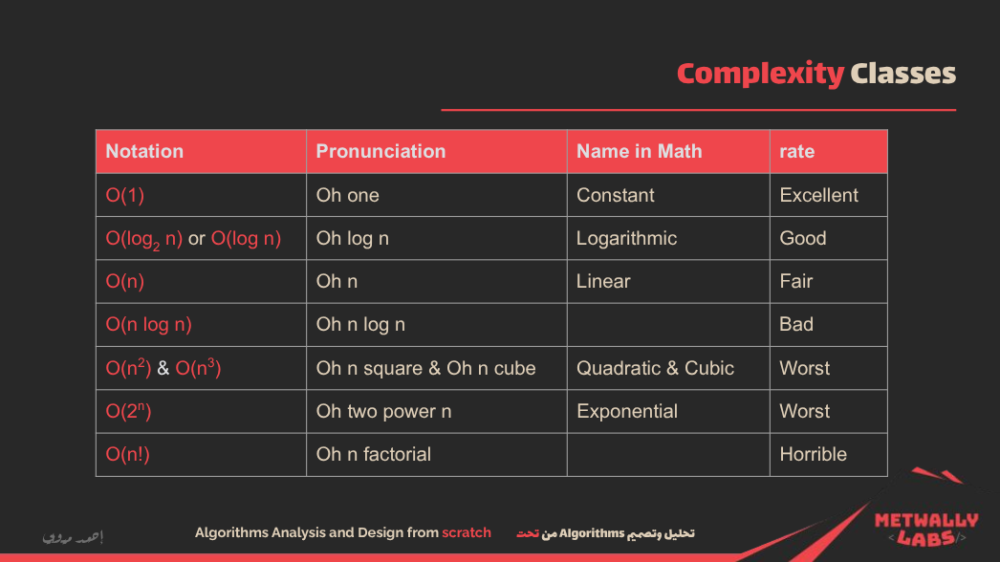

# Insertion Sort


lecture link: [insertion-sort-algorithm-code-analysis](https://cloudnativebasecamp.com/lessons/09-insertion-sort-algorithm-code-analysis/)

## Algorithm

For example, given the array `[5, 2, 4, 6, 1, 3]`:

- Start with `5` (already sorted).
- Insert `2`: compare with `5`, shift `5` right, insert `2` at the beginning → `[2, 5, 4, 6, 1, 3]`.
- Insert `4`: compare with `5`, shift `5`, and insert `4` → `[2, 4, 5, 6, 1, 3]`.
- Insert `6`: already in correct position.
- Insert `1`: shift `6`, `5`, `4`, `2`, and insert `1` at the beginning → `[1, 2, 4, 5, 6, 3]`.
- Insert `3`: shift `6`, `5`, `4`, and insert `3` → `[1, 2, 3, 4, 5, 6]`.

It is efficient for small datasets or nearly sorted arrays but performs poorly on large lists (O(n²) time complexity).

Here is a practical TypeScript implementation of insertion sort:

```ts
function insertionSort(arr: number[]): number[] {
  for (let i = 1; i < arr.length; i++) {
    let key = arr[i];
    let j = i - 1;

    // Move elements of arr[0..i-1], that are greater than key, to one position ahead
    while (j >= 0 && arr[j] > key) {
      arr[j + 1] = arr[j];
      j = j - 1;
    }
    arr[j + 1] = key;
  }
  return arr;
}

// Example usage
const numbers = [5, 2, 4, 6, 1, 3];
console.log(insertionSort(numbers)); // Output: [1, 2, 3, 4, 5, 6]
```

This implementation sorts the array in place and returns the sorted array. It uses a `while` loop to shift elements and insert the current `key` into its correct position. This approach is practical for situations where simplicity is more important than raw speed, such as sorting small user input or nearly sorted lists in web applications.

## Problems

- **[easy]** [Sort Array By Parity](https://leetcode.com/problems/sort-array-by-parity/)

Given an integer array `nums`, move all the even integers at the beginning of the array followed by all the odd integers. You may return any array that satisfies this condition. This is simple and can be solved using insertion sort logic by separating even and odd numbers while iterating.

---

- **[meduim]** [Sort Colors](https://leetcode.com/problems/sort-colors/)

Given an array `nums` with `n` objects colored red, white, or blue, sort them in-place so that objects of the same color are adjacent, with the colors in the order red, white, and blue. This is essentially a variant of insertion sort, often called the Dutch National Flag problem.

---

- **[hard]** [Reverse Pairs](https://leetcode.com/problems/reverse-pairs/)

Given an integer array `nums`, return the number of reverse pairs in the array. A reverse pair is a pair `(i, j)` where `0 <= i < j < nums.length` and `nums[i] > 2 * nums[j]`. This is much harder because it requires modified merge sort or efficient insertion sort techniques to avoid TLE on large arrays.

---

# Merge Sort


lecture link [divide-conquer-merge-sort-code](https://cloudnativebasecamp.com/lessons/11-divide-conquer-merge-sort-code/)

## Algorithm

Merge Sort is a divide-and-conquer algorithm that splits the array into two halves, recursively sorts each half, and then merges the two sorted halves back together. It efficiently handles large datasets with a time complexity of O(n log n), which is much faster than algorithms like Bubble Sort and Insertion Sort for large arrays.

The algorithm works by:

1. Dividing the array into two halves.
2. Recursively sorting each half.
3. Merging the sorted halves back together to form a single sorted array.

For example, given the array `[38, 27, 43, 3, 9, 82, 10]`:

- First, split it into two halves: `[38, 27, 43]` and `[3, 9, 82, 10]`.
- Recursively split each half until single-element arrays are obtained:

  - `[38, 27, 43]` becomes `[38]`, `[27]`, `[43]`.
  - `[3, 9, 82, 10]` becomes `[3]`, `[9]`, `[82]`, `[10]`.

- Merge the smaller arrays back together, sorting as you go:

  - `[38]` and `[27]` merge to form `[27, 38]`.
  - `[27, 38]` and `[43]` merge to form `[27, 38, 43]`.
  - Similarly, merge the second half `[3, 9, 10, 82]`.
  - Finally, merge the two sorted halves to form `[3, 9, 10, 27, 38, 43, 82]`.

Here is the TypeScript implementation of Merge Sort:

```ts
function mergeSort(arr: number[]): number[] {
  if (arr.length <= 1) {
    return arr;
  }

  const mid = Math.floor(arr.length / 2);
  const left = mergeSort(arr.slice(0, mid));
  const right = mergeSort(arr.slice(mid));

  return merge(left, right);
}

function merge(left: number[], right: number[]): number[] {
  let result: number[] = [];
  let leftIndex = 0;
  let rightIndex = 0;

  while (leftIndex < left.length && rightIndex < right.length) {
    if (left[leftIndex] < right[rightIndex]) {
      result.push(left[leftIndex]);
      leftIndex++;
    } else {
      result.push(right[rightIndex]);
      rightIndex++;
    }
  }

  return result.concat(left.slice(leftIndex), right.slice(rightIndex));
}

// Example usage
const numbers = [38, 27, 43, 3, 9, 82, 10];
console.log(mergeSort(numbers)); // Output: [3, 9, 10, 27, 38, 43, 82]
```

This implementation divides the array into smaller subarrays, recursively sorts them, and then merges the sorted subarrays. The merge function compares elements from the left and right subarrays, ensuring that the result is always sorted. The merge process continues until all elements are combined into a single sorted array. Merge Sort is particularly useful for large datasets or when stability (maintaining the relative order of equal elements) is important.

## Problems

- **[easy]** [Merge Sorted Array](https://leetcode.com/problems/merge-sorted-array/)

Given two sorted integer arrays `nums1` and `nums2`, merge them into a single sorted array. The merged array should be stored in `nums1` without returning anything. This problem is straightforward and can be solved using the merge step of the merge sort algorithm.

---

- **[meduim]** [Sort an Array](https://leetcode.com/problems/sort-an-array/)

Given an array of integers, sort the array in ascending order and return it. You must solve the problem without using any built-in functions in O(nlog(n)) time complexity and with the smallest space complexity possible. This problem can be efficiently solved using merge sort.

---

- **[hard]** [Merge k Sorted Lists](https://leetcode.com/problems/merge-k-sorted-lists/)

You are given an array of k linked-lists, each linked-list is sorted in ascending order. Merge all the linked-lists into one sorted linked-list and return it. This problem requires a more advanced application of merge sort, utilizing a priority queue or a divide-and-conquer approach.

---

# Binary search


lecture link [binary-search-algorithm-code](https://cloudnativebasecamp.com/lessons/13-binary-search-algorithm-code/)

## Algorithm

Binary Search is a highly efficient algorithm for finding an element in a sorted array. It works by repeatedly dividing the search interval in half. If the value of the target element is less than the value in the middle of the interval, the search continues on the left half, otherwise it continues on the right half. This process repeats until the element is found or the interval is empty.

The algorithm assumes that the array is sorted, and its time complexity is O(log n), making it much faster than linear search for large datasets.

For example, given the sorted array `[1, 3, 5, 7, 9, 11, 13, 15]` and a target value of `7`:

- Start by comparing `7` with the middle element `7` (index 3).
- Since `7` is equal to the middle element, the search ends and `7` is found at index 3.

If the target is `10`, the search would:

- Start by comparing `10` with the middle element `7`.
- Since `10` is greater, the search continues on the right half `[9, 11, 13, 15]`.
- The middle element of the new subarray is `11`, which is greater than `10`, so the search continues on the left half `[9]`.
- The middle element is `9`, which is less than `10`, so the search would conclude that `10` is not in the array.

Here is the TypeScript implementation of Binary Search:

```ts
function binarySearch(arr: number[], target: number): number {
  let left = 0;
  let right = arr.length - 1;

  while (left <= right) {
    const mid = Math.floor((left + right) / 2);

    if (arr[mid] === target) {
      return mid; // Element found
    } else if (arr[mid] < target) {
      left = mid + 1; // Search in the right half
    } else {
      right = mid - 1; // Search in the left half
    }
  }

  return -1; // Element not found
}

// Example usage
const numbers = [1, 3, 5, 7, 9, 11, 13, 15];
console.log(binarySearch(numbers, 7)); // Output: 3
console.log(binarySearch(numbers, 10)); // Output: -1
```

In this implementation, `left` and `right` track the current search boundaries. The middle index `mid` is calculated by averaging `left` and `right`. If the element at `mid` matches the target, its index is returned. Otherwise, the search space is halved by adjusting either `left` or `right` based on the comparison. If the element is not found, `-1` is returned. Binary Search is ideal for large datasets due to its logarithmic time complexity.

## Problems

- **[easy]** [Binary Search](https://leetcode.com/problems/binary-search/)

Given a sorted array of integers `nums` and a target value `target`, implement a function to search for `target` in `nums`. If `target` exists, return its index; otherwise, return -1. The solution must have a time complexity of O(log n).

---

- **[meduim]** [Search in Rotated Sorted Array](https://leetcode.com/problems/search-in-rotated-sorted-array/)

Suppose an array of length `n` sorted in ascending order is rotated between 1 and `n` times. Given the rotated sorted array `nums` and an integer `target`, return the index of `target` if it exists in the array; otherwise, return -1. You must solve it in O(log n) time complexity.

---

- **[hard]** [Median of Two Sorted Arrays](https://leetcode.com/problems/median-of-two-sorted-arrays/)

Given two sorted arrays `nums1` and `nums2` of size m and n respectively, find the median of the two sorted arrays. The solution should be implemented in O(log(min(m, n))) time complexity.

---

# Segregate Positive and Negative Numbers


lecture link [segregate-positive-and-negative-numbers-algorithm](https://cloudnativebasecamp.com/lessons/14-segregate-positive-and-negative-numbers-algorithm/)

## Algorithm

The Segregate Positive and Negative Numbers algorithm rearranges the elements of an array so that all negative numbers appear before all positive numbers. The relative order of the elements is not necessarily preserved. This can be achieved in O(n) time complexity, where n is the number of elements in the array.

The approach involves:

1. Iterating through the array and maintaining two sections: one for negative numbers and one for positive numbers.
2. Using a partitioning technique (similar to the one used in the quicksort algorithm), we iterate through the array and swap elements in place, moving negative numbers to the front and positive numbers to the back.

For example, given the array `[12, -7, -5, 70, -3, 15]`:

- We start by scanning through the array.
- As we encounter `-7`, `-5`, and `-3` (negative numbers), we move them to the left.
- Positive numbers like `12`, `70`, and `15` are moved to the right.
- The final array becomes `[-7, -5, -3, 70, 12, 15]`.

Here is a TypeScript implementation of the Segregate Positive and Negative Numbers algorithm:

```ts
function segregatePositiveAndNegative(arr: number[]): number[] {
  let left = 0;
  let right = arr.length - 1;

  while (left <= right) {
    if (arr[left] < 0 && arr[right] >= 0) {
      // If left is negative and right is positive, we don't need to swap
      left++;
      right--;
    } else if (arr[left] >= 0 && arr[right] < 0) {
      // If left is positive and right is negative, swap them
      [arr[left], arr[right]] = [arr[right], arr[left]];
      left++;
      right--;
    } else {
      if (arr[left] >= 0) left++; // Move left pointer to the right
      if (arr[right] < 0) right--; // Move right pointer to the left
    }
  }
  return arr;
}

// Example usage
const numbers = [12, -7, -5, 70, -3, 15];
console.log(segregatePositiveAndNegative(numbers)); // Output: [-7, -5, -3, 70, 12, 15]
```

This algorithm uses two pointers: one starting from the left (for negative numbers) and one from the right (for positive numbers). It performs in-place swapping, so no extra space is used, making it efficient. The result is an array where all negative numbers are on the left side and positive numbers are on the right. The algorithm works in linear time O(n), where n is the number of elements in the array.

## Problems

- **[easy]** [Rearrange Array Elements by Sign](https://leetcode.com/problems/rearrange-array-elements-by-sign/)

Given an integer array `nums` of even length consisting of an equal number of positive and negative integers, rearrange the array such that every consecutive pair of integers have opposite signs, while preserving the relative order of elements with the same sign.

---

- **[meduim]** [Maximum Count of Positive Integer and Negative Integer](https://leetcode.com/problems/maximum-count-of-positive-integer-and-negative-integer/)

Given a sorted array `nums`, return the maximum between the number of positive integers and the number of negative integers. Note that 0 is neither positive nor negative.

---

- **[hard]** [First Missing Positive](https://leetcode.com/problems/first-missing-positive/)

Given an unsorted integer array `nums`, find the smallest missing positive integer. You must implement an algorithm that runs in O(n) time and uses O(1) auxiliary space.

---

# Activity Selection (Greedy Algorithm)


lecture link [greedy-algorithm-activity-selection-problem-algorithm-code](https://cloudnativebasecamp.com/lessons/18-greedy-algorithm-activity-selection-problem-algorithm-code/)

## Algorithm

Activity Selection is a classic problem that can be solved efficiently using a greedy algorithm. The problem is: given a set of activities with start and end times, select the maximum number of activities that don't overlap. The greedy choice is to always pick the activity that finishes earliest, which leaves the most room for subsequent activities.

The steps of the algorithm are:

1. Sort all activities by their end time.
2. Select the first activity (the one that ends earliest).
3. For each remaining activity, select it if its start time is greater than or equal to the end time of the last selected activity.

For example, given these activities with start and end times:

```ts
Activities:  A1  A2  A3  A4  A5  A6
Start:       1   3   0   5   8   5
End:         2   4   6   7   9   9
```

- Sort by end time:

  - A1 (1,2), A2 (3,4), A4 (5,7), A5 (8,9), A6 (5,9), A3 (0,6)

- Select A1 (ends at 2).
- Next, A2 starts at 3 (≥ 2), select it (ends at 4).
- A4 starts at 5 (≥ 4), select it (ends at 7).
- A5 starts at 8 (≥ 7), select it (ends at 9).
- A6 and A3 are skipped because they overlap with the selected ones.

Maximum selected activities: A1, A2, A4, A5.

Here is a TypeScript implementation:

```ts
type Activity = {
  start: number;
  end: number;
};

function activitySelection(activities: Activity[]): Activity[] {
  // Sort activities by their end time
  activities.sort((a, b) => a.end - b.end);

  let selected: Activity[] = [];
  let lastEndTime = 0;

  for (let activity of activities) {
    if (activity.start >= lastEndTime) {
      selected.push(activity);
      lastEndTime = activity.end;
    }
  }

  return selected;
}

// Example usage
const activities: Activity[] = [
  { start: 1, end: 2 },
  { start: 3, end: 4 },
  { start: 0, end: 6 },
  { start: 5, end: 7 },
  { start: 8, end: 9 },
  { start: 5, end: 9 },
];

const result = activitySelection(activities);
console.log(result);
// Output: [{start:1,end:2}, {start:3,end:4}, {start:5,end:7}, {start:8,end:9}]
```

This implementation sorts the activities by end time and then iterates through them, selecting an activity only if it starts after or when the last selected activity ends. This greedy approach guarantees the maximum number of non-overlapping activities, making it both efficient and practical for scheduling problems.

## Problems

- **[easy]** [Assign Cookies](https://leetcode.com/problems/assign-cookies/)

Given an array `g` representing the greed factor of each child and an array `s` representing the size of each cookie, assign each cookie to a child such that each child gets at most one cookie and the cookie is large enough to satisfy the child's greed. Return the maximum number of children you can satisfy. This problem can be solved using a greedy algorithm by sorting both arrays and using a two-pointer technique.

---

- **[meduim]** [Maximum Length of Pair Chain](https://leetcode.com/problems/maximum-length-of-pair-chain/)

You are given an array of `n` pairs `pairs` where `pairs[i] = [lefti, righti]` and `lefti < righti`. A pair `p2 = [c, d]` follows a pair `p1 = [a, b]` if and only if `b < c`. A chain of pairs can be formed in this fashion. Return the length of the longest chain which can be formed. This problem is a direct application of the activity selection problem and can be solved using a greedy algorithm by sorting the pairs based on their end times and selecting the maximum number of non-overlapping pairs.

---

- **[hard]** [Maximum Profit in Job Scheduling](https://leetcode.com/problems/maximum-profit-in-job-scheduling/)

We have `n` jobs, where each job is scheduled to be done from `startTime[i]` to `endTime[i]`, obtaining a profit of `profit[i]`. You're given the `startTime`, `endTime`, and `profit` arrays, return the maximum profit you can take such that there are no two jobs in the subset with overlapping time range. This problem extends the activity selection problem by introducing profits and requires a more advanced approach, such as dynamic programming combined with binary search, to find the optimal solution.

---

# sorted characters frequencies


lecture link [sorted-characters-frequencies-algorithm-code/](https://cloudnativebasecamp.com/lessons/19-sorted-characters-frequencies-algorithm-code/)

## Algorithm

The sorted characters frequencies algorithm counts how often each character appears in a given string, then sorts the characters based on their frequency in descending order. If needed, characters with the same frequency can be sorted alphabetically or by their first appearance. This kind of logic is practical in tasks like text analysis, compression algorithms, or building frequency tables.

The steps of the algorithm are:

1. Iterate through the string and count each character's frequency using a map or object.
2. Convert the frequency map to an array of `[character, frequency]` pairs.
3. Sort the array based on frequency in descending order (and by character if secondary sorting is needed).
4. Return or display the sorted result.

For example, given the string `"programming"`:

- Frequencies:

  - `r`: 2
  - `g`: 2
  - `m`: 2
  - `p`: 1
  - `o`: 1
  - `a`: 1
  - `i`: 1
  - `n`: 1

- After sorting by frequency:

  - `r`, `g`, `m` (frequency 2)
  - `p`, `o`, `a`, `i`, `n` (frequency 1)

Here is a practical TypeScript implementation:

```ts
function sortedCharFrequencies(text: string): [string, number][] {
  const freqMap: Record<string, number> = {};

  for (const char of text) {
    freqMap[char] = (freqMap[char] || 0) + 1;
  }

  const freqArray: [string, number][] = Object.entries(freqMap);

  freqArray.sort((a, b) => {
    if (b[1] === a[1]) {
      return a[0].localeCompare(b[0]); // Sort alphabetically if frequencies are equal
    }
    return b[1] - a[1]; // Sort by frequency descending
  });

  return freqArray;
}

// Example usage
const text = "programming";
const result = sortedCharFrequencies(text);
console.log(result);
// Output: [['g', 2], ['m', 2], ['r', 2], ['a', 1], ['i', 1], ['n', 1], ['o', 1], ['p', 1]]
```

This code counts each character's frequency, then sorts the characters by descending frequency. In case two characters have the same frequency, they are sorted alphabetically. This approach is practical and scalable even for longer strings and is useful for feature extraction, frequency analysis, or building histograms in software projects.

## Problems

- **[easy]** [Sort Characters By Frequency](https://leetcode.com/problems/sort-characters-by-frequency/)
  Given a string `s`, sort it in decreasing order based on the frequency of the characters. Return the sorted string. You can assume that the string only contains ASCII characters.

---

- **[meduim]** [Top K Frequent Words](https://leetcode.com/problems/top-k-frequent-words/)
  Given an array of strings `words` and an integer `k`, return the `k` most frequent strings. The answer should be sorted by frequency from highest to lowest. If multiple words have the same frequency, sort them alphabetically.

---

- **[hard]** [Rearrange String k Distance Apart](https://leetcode.com/problems/rearrange-string-k-distance-apart/)
  Given a string `s` and an integer `k`, rearrange the string such that the same characters are at least distance `k` from each other. If it's not possible, return an empty string. All characters are assumed to be lowercase English letters.

---

# Hoffman coding


lecture link [huffman-coding-algorithm](https://cloudnativebasecamp.com/lessons/20-greedy-algorithm-huffman-coding-algorithm/)

## Algorithm

Huffman Coding is a greedy algorithm used for lossless data compression. It assigns variable-length binary codes to input characters, where more frequent characters get shorter codes, and less frequent ones get longer codes. This reduces the overall size when encoding large amounts of text. Huffman coding guarantees the smallest average code length among all prefix-free (no code is a prefix of another) binary encodings.

The steps of the algorithm are:

1. Count the frequency of each character in the input.
2. Create a priority queue (min-heap) where each node contains a character and its frequency.
3. While there is more than one node in the queue:

   - Remove the two nodes with the smallest frequency.
   - Create a new node with these two as children and with frequency equal to their sum.
   - Insert the new node back into the queue.

4. The remaining node is the root of the Huffman tree.
5. Generate codes by traversing the tree:

   - Assign `0` when moving left and `1` when moving right.
   - Leaf nodes hold the final code for each character.

For example, given characters with frequencies:

```ts
a: 5, b: 9, c: 12, d: 13, e: 16, f: 45
```

- Build the Huffman tree combining smallest pairs repeatedly:

  - Combine `a` and `b` → frequency 14
  - Combine `c` and `d` → frequency 25
  - Continue combining until the tree is formed

- The generated codes may look like:

  - `f`: `0`
  - `c`: `100`
  - `d`: `101`
  - `a`: `1100`
  - `b`: `1101`
  - `e`: `111`

Here is a practical TypeScript implementation:

```ts
type Node = {
  char?: string;
  freq: number;
  left?: Node;
  right?: Node;
};

function buildHuffmanTree(freqMap: Record<string, number>): Node {
  let nodes: Node[] = Object.entries(freqMap).map(([char, freq]) => ({
    char,
    freq,
  }));

  while (nodes.length > 1) {
    // Sort nodes by frequency ascending
    nodes.sort((a, b) => a.freq - b.freq);

    // Take two nodes with smallest frequencies
    const left = nodes.shift()!;
    const right = nodes.shift()!;

    // Create new parent node
    const newNode: Node = {
      freq: left.freq + right.freq,
      left,
      right,
    };

    nodes.push(newNode);
  }

  return nodes[0];
}

function generateCodes(
  node: Node,
  prefix = "",
  codeMap: Record<string, string> = {}
): Record<string, string> {
  if (node.char !== undefined) {
    codeMap[node.char] = prefix;
  } else {
    if (node.left) generateCodes(node.left, prefix + "0", codeMap);
    if (node.right) generateCodes(node.right, prefix + "1", codeMap);
  }
  return codeMap;
}

// Example usage
const text = "aaabbc";
const freqMap: Record<string, number> = {};

for (const char of text) {
  freqMap[char] = (freqMap[char] || 0) + 1;
}

const tree = buildHuffmanTree(freqMap);
const codes = generateCodes(tree);
console.log(codes);
// Output example: { a: '0', b: '10', c: '11' }
```

This implementation builds the Huffman tree based on character frequencies and then generates binary codes by traversing the tree. It uses a simple array for the priority queue (which is fine for small datasets but can be optimized using a real heap). This algorithm is highly effective in compressing files where character frequency is skewed, like text files or structured data, and forms the basis for compression formats like ZIP and JPEG.

## Problems

- **[easy]** [Encode and Decode TinyURL](https://leetcode.com/problems/encode-and-decode-tinyurl/)
  Design a tiny URL service to encode a long URL to a short one and decode it back to the original URL. While it's not Huffman coding directly, the principles of encoding and decoding map closely to simplified coding tree logic.

---

- **[meduim]** [Design File System](https://leetcode.com/problems/design-file-system/)
  Design a file system that supports creating new paths and retrieving values. Concepts like prefix trees and efficient path encoding are fundamental, and similar tree-based structure logic is applied in Huffman encoding.

---

- **[hard]** [Optimal Account Balancing](https://leetcode.com/problems/optimal-account-balancing/)
  Given a list of transactions between people, minimize the number of transactions to settle debt. This problem requires optimal merging and balancing strategies, which have algorithmic similarity to constructing minimal-cost trees like Huffman Trees.

---

# Fractional Knapsack Problem


lecture link [Fractional Knapsack Problem](https://cloudnativebasecamp.com/lessons/22-greedy-algorithm-fractional-knapsack-problem-algorithm-code/)

## Algorithm

The Fractional Knapsack Problem is a greedy algorithm used in optimization, where you aim to maximize the total value you can carry in a knapsack with a weight limit. Unlike the 0/1 Knapsack (where you must take the entire item or leave it), in the fractional version, you are allowed to take any fraction of an item. This flexibility makes the problem solvable using a straightforward greedy strategy.

The steps of the algorithm are:

1. For each item, calculate its value-to-weight ratio (`value / weight`).
2. Sort all items by this ratio in descending order.
3. Start filling the knapsack:

   - Always pick as much as possible from the item with the highest ratio.
   - If the full item can fit, take it entirely.
   - If not, take only the fraction that fits.

4. Continue until the knapsack is full or all items are considered.

For example, consider a knapsack with a weight capacity of 50 and these items:

```ts
Item 1: value = 60, weight = 10 → ratio = 6
Item 2: value = 100, weight = 20 → ratio = 5
Item 3: value = 120, weight = 30 → ratio = 4
```

- Sort items: Item 1 (6), Item 2 (5), Item 3 (4)
- Take all of Item 1 (10 weight), remaining capacity = 40
- Take all of Item 2 (20 weight), remaining capacity = 20
- Take 20/30 fraction of Item 3 (20 weight), which gives value `120 * (20/30) = 80`
- Total value = 60 + 100 + 80 = 240

Here is a practical TypeScript implementation:

```ts
type Item = {
  value: number;
  weight: number;
};

function fractionalKnapsack(capacity: number, items: Item[]): number {
  // Calculate value-to-weight ratio and sort by it descending
  items.sort((a, b) => b.value / b.weight - a.value / a.weight);

  let totalValue = 0;
  let remainingCapacity = capacity;

  for (let item of items) {
    if (remainingCapacity === 0) break;

    if (item.weight <= remainingCapacity) {
      // Take the whole item
      totalValue += item.value;
      remainingCapacity -= item.weight;
    } else {
      // Take the fractional part
      let fraction = remainingCapacity / item.weight;
      totalValue += item.value * fraction;
      remainingCapacity = 0;
    }
  }

  return totalValue;
}

// Example usage
const items: Item[] = [
  { value: 60, weight: 10 },
  { value: 100, weight: 20 },
  { value: 120, weight: 30 },
];

const capacity = 50;
const maxValue = fractionalKnapsack(capacity, items);
console.log(maxValue);
// Output: 240
```

This implementation first sorts the items by their value-to-weight ratio and then greedily picks items (or fractions) until the knapsack's capacity is used up. This greedy method is mathematically proven to always yield the optimal solution in the fractional case. It is widely used in real-world scenarios like resource allocation, cargo loading, and financial investments where partial quantities are allowed.

## Problems

- **[easy]** [Maximum Units on a Truck](https://leetcode.com/problems/maximum-units-on-a-truck/)
  You are given the number of boxes of different types, each with a certain number of units per box. You need to load boxes onto a truck to maximize the total number of units without exceeding the truck size. This is a direct application of the fractional knapsack greedy approach.

---

- **[meduim]** [Bag of Tokens](https://leetcode.com/problems/bag-of-tokens/)
  Given an initial power and a bag of tokens with different values, you may play tokens face up or face down to maximize your score. The decision to play tokens optimally resembles the greedy ratio-based selection in the fractional knapsack.

---

- **[hard]** [IPO](https://leetcode.com/problems/ipo/)
  Given capital and a list of projects each with a profit and a required capital, you must choose at most `k` projects to maximize your final capital. This problem requires sorting and greedily selecting projects, similar to selecting items in the fractional knapsack by profit-to-capital ratio.

---

# Dynamic Programming

dynamic programming is more of a mindset and complex topic to be summarised byt for now

- the first lecture link [dynamic-programming-stagecoach-problem-algorithm-code/](https://cloudnativebasecamp.com/lessons/23-dynamic-programming-stagecoach-problem-algorithm-code/)

- a great video [5 Simple Steps for Solving Dynamic Programming Problems](https://www.youtube.com/watch?v=aPQY__2H3tE&pp=ygUTZHluYW1pYyBwcm9ncmFtbWluZw%3D%3D)

- a playlist by [abdul-bary](https://www.youtube.com/playlist?list=PLJULIlvhz0rE83NKhnq7acXYIeA0o1dXb)

- 5 hours tutorial on [freecodecamp](https://www.youtube.com/watch?v=oBt53YbR9Kk)

anyway the most important thing is not the material but silving problems on it so here are the problems to be solved

## Problems on _Stagecoach_

- **[easy]** [Minimum Path Sum](https://leetcode.com/problems/minimum-path-sum/)

You are given a m x n grid filled with non-negative numbers. Your task is to find a path from the top-left corner to the bottom-right corner such that the sum of the numbers along the path is minimized. You are allowed to move only right or down at any point. This problem represents the simplest stage-based path optimization using dynamic programming.

---

- **[meduim]** [Triangle](https://leetcode.com/problems/triangle/)

Given a triangle array, find the minimum path sum from top to bottom. At each step, you may move to adjacent numbers on the row below. The triangle shape adds variation in movement and forces you to decide between multiple adjacent options, making it a more complex but classic DP problem connected to stagecoach models.

---

- **[hard]** [Minimum Cost to Make at Least One Valid Path in a Grid](https://leetcode.com/problems/minimum-cost-to-make-at-least-one-valid-path-in-a-grid/)

You are given a grid with arrows indicating the direction of movement allowed in each cell. Changing the direction of a cell costs 1. Your task is to modify as few cells as possible to create at least one valid path from the top-left to the bottom-right corner. This problem mixes grid DP with BFS techniques and variable movement costs, representing an advanced level of stage-based dynamic programming.

---

## Problems on _Longest Common Subsequence_

- **[easy]** [Longest Common Subsequence Between Two Strings](https://leetcode.com/problems/delete-operation-for-two-strings/)

Given two strings word1 and word2, return the minimum number of steps required to make word1 and word2 the same. In one step, you can delete exactly one character in either string. This problem is a simplified application of the longest common subsequence idea, framed in terms of deletions, making it more approachable while still using the classic LCS dynamic programming table.

---

- **[meduim]** [Longest Common Subsequence](https://leetcode.com/problems/longest-common-subsequence/)

Given two strings text1 and text2, return the length of their longest common subsequence. A subsequence is a sequence derived by deleting some or no characters without changing the order of the remaining characters. This is the textbook LCS problem, using dynamic programming with a 2D table to track common subsequences as you iterate through both strings.

---

- **[hard]** [Edit Distance](https://leetcode.com/problems/edit-distance/)

Given two strings word1 and word2, return the minimum number of operations required to convert word1 to word2. You may perform insertions, deletions, or substitutions. This is a more complex extension of the LCS concept, where you track multiple operations and compute minimal edit paths using dynamic programming, making it one of the harder problems in this category.

---

## Problems

- **[easy]** [Last Stone Weight II](https://leetcode.com/problems/last-stone-weight-ii/)

You are given an array of stones where each stone has a positive integer weight. In each turn, you choose any two stones and smash them together. The goal is to minimize the weight of the last remaining stone (or end with zero if possible). This is an easy-level problem that reduces to a subset-sum variation, which directly maps to the 0/1 knapsack dynamic programming structure.

---

- **[meduim]** [Partition Equal Subset Sum](https://leetcode.com/problems/partition-equal-subset-sum/)

Given a non-empty array containing only positive integers, determine if the array can be partitioned into two subsets such that the sum of elements in both subsets is equal. This is a standard medium-level problem that applies 0/1 knapsack dynamic programming by trying to find a subset with a target sum, using a DP array to track achievable sums.

---

- **[hard]** [Ones and Zeroes](https://leetcode.com/problems/ones-and-zeroes/)

Given an array of binary strings and two integers m and n, return the size of the largest subset such that there are at most m 0's and n 1's in the subset. This is a classic hard-level 0/1 knapsack problem but extended to two dimensions, requiring careful DP state management over both zero and one counts, which makes it considerably more challenging.

---

# Graph Algorithms


- first lecture [Graph – Introduction](https://cloudnativebasecamp.com/lessons/26-graph-introduction/)

- nice freecodecamp tutorial [Graph Algorithms for Technical Interviews - Full Course
  ]()

## Types of graphs


# Prim's minimmum spanning tree


lecture link [Graph – Prim’s Minimum Spanning Tree – Algorithm – Code](https://cloudnativebasecamp.com/lessons/27-graph-prims-minimum-spanning-tree-algorithm-code/)

## Algorithm

Prim's Minimum Spanning Tree (MST) algorithm is a greedy graph algorithm used to find a subset of edges that connects all vertices in an undirected, weighted graph with the minimum possible total edge weight and without any cycles. Prim's algorithm starts from a chosen node and repeatedly adds the smallest edge that connects a node in the tree to a node outside the tree.

### Example Explanation:

Imagine a graph with nodes `A`, `B`, `C`, and `D`:

- `A` is connected to `B` (weight 1), `C` (weight 3)
- `B` is connected to `C` (weight 1), `D` (weight 4)
- `C` is connected to `D` (weight 2)

If we start with node `A`:

- The smallest edge is `A-B` (weight 1)
- Next, from nodes `A` and `B`, the smallest edge is `B-C` (weight 1)
- Then, from `A`, `B`, and `C`, the smallest edge is `C-D` (weight 2)

Total MST weight = 1 (A-B) + 1 (B-C) + 2 (C-D) = 4

### TypeScript Example

```ts
type Edge = [number, number, number]; // [source, destination, weight]

class Graph {
  vertices: number;
  adjList: Map<number, [number, number][]>;

  constructor(vertices: number) {
    this.vertices = vertices;
    this.adjList = new Map();

    for (let i = 0; i < vertices; i++) {
      this.adjList.set(i, []);
    }
  }

  addEdge(u: number, v: number, w: number) {
    this.adjList.get(u)?.push([v, w]);
    this.adjList.get(v)?.push([u, w]); // Undirected graph
  }

  primMST() {
    const key: number[] = Array(this.vertices).fill(Infinity);
    const parent: number[] = Array(this.vertices).fill(-1);
    const inMST: boolean[] = Array(this.vertices).fill(false);

    key[0] = 0;

    for (let count = 0; count < this.vertices - 1; count++) {
      let u = this.minKey(key, inMST);
      inMST[u] = true;

      for (let [v, weight] of this.adjList.get(u) || []) {
        if (!inMST[v] && weight < key[v]) {
          key[v] = weight;
          parent[v] = u;
        }
      }
    }

    for (let i = 1; i < this.vertices; i++) {
      console.log(`Edge: ${parent[i]} - ${i}, Weight: ${key[i]}`);
    }
  }

  private minKey(key: number[], inMST: boolean[]): number {
    let min = Infinity;
    let minIndex = -1;

    for (let v = 0; v < this.vertices; v++) {
      if (!inMST[v] && key[v] < min) {
        min = key[v];
        minIndex = v;
      }
    }
    return minIndex;
  }
}

// Example usage:
const g = new Graph(4);
g.addEdge(0, 1, 1);
g.addEdge(0, 2, 3);
g.addEdge(1, 2, 1);
g.addEdge(1, 3, 4);
g.addEdge(2, 3, 2);

g.primMST();
```

In this code:

- Nodes are numbered from 0 to 3
- `addEdge` connects two nodes with a weight
- `primMST` applies Prim’s logic to compute and print the MST edges

This example is practical for small to medium-sized graphs and is easily adaptable if you want to handle input dynamically or connect it with real-world data structures.

## Problems

- **[easy]** [Optimize Water Distribution in a Village](https://leetcode.com/problems/optimize-water-distribution-in-a-village/)

There are n houses in a village, and you want to supply water to all houses. You can either build a well in each house or connect the house to another house with a pipe. The cost to build wells and lay pipes is given. Find the minimum total cost to supply water to all houses. This is an easy application of Prim's algorithm where the graph includes virtual edges (wells) and you build the minimum spanning tree considering both direct and indirect connections.

---

- **[meduim]** [Connecting Cities With Minimum Cost](https://leetcode.com/problems/connecting-cities-with-minimum-cost/)

You are given the cost of connecting every pair of cities. Your task is to connect all cities with minimum total cost. A connection is bidirectional, and you can only connect directly or indirectly. This problem is a direct application of Prim's or Kruskal's algorithm to build the minimum spanning tree that connects all cities at minimal cost.

---

- **[hard]** [Min Cost to Connect All Points](https://leetcode.com/problems/min-cost-to-connect-all-points/)

Given an array of points in a 2D plane, return the minimum cost to make all points connected. The cost to connect two points is the Manhattan distance between them. This is a hard version of the MST problem where you must compute pairwise costs and then apply Prim’s algorithm (or Kruskal's) efficiently over potentially large input sizes, making it computationally heavier.

---

# Breadth first search


lecture link [Graph – Breadth First Search – Algorithm – Code
](https://cloudnativebasecamp.com/lessons/28-graph-breadth-first-search-algorithm-code/)

## Algorithm

Breadth-First Search (BFS) is a traversal algorithm for graphs that visits nodes in layers, exploring all neighbors of the current node before moving to the next layer. It guarantees the shortest path (in terms of the number of edges) from the start node in an unweighted graph. BFS uses a queue to manage the nodes to visit next and a visited array or set to prevent revisiting nodes.

### Example Explanation:

Consider this undirected graph with nodes `0`, `1`, `2`, and `3`:

- `0` is connected to `1` and `2`
- `1` is connected to `3`
- `2` is connected to `3`

If we perform BFS starting from node `0`:

- Start with `0`, mark it visited
- Visit neighbors `1` and `2`, mark them visited and add them to the queue
- Next, visit `1`, which connects to `3` (add `3` to the queue)
- Then visit `2` (but `3` is already visited)
- Finally, visit `3`

Traversal order will be: `0 → 1 → 2 → 3`

### TypeScript Example

```ts
class Graph {
  vertices: number;
  adjList: Map<number, number[]>;

  constructor(vertices: number) {
    this.vertices = vertices;
    this.adjList = new Map();

    for (let i = 0; i < vertices; i++) {
      this.adjList.set(i, []);
    }
  }

  addEdge(u: number, v: number) {
    this.adjList.get(u)?.push(v);
    this.adjList.get(v)?.push(u); // Undirected graph
  }

  bfs(start: number) {
    const visited: boolean[] = Array(this.vertices).fill(false);
    const queue: number[] = [];

    visited[start] = true;
    queue.push(start);

    while (queue.length > 0) {
      const node = queue.shift()!;
      console.log(`Visited: ${node}`);

      for (const neighbor of this.adjList.get(node) || []) {
        if (!visited[neighbor]) {
          visited[neighbor] = true;
          queue.push(neighbor);
        }
      }
    }
  }
}

// Example usage:
const g = new Graph(4);
g.addEdge(0, 1);
g.addEdge(0, 2);
g.addEdge(1, 3);
g.addEdge(2, 3);

g.bfs(0);
```

This example:

- Creates a graph with 4 nodes (`0`, `1`, `2`, `3`)
- Uses `addEdge` to connect nodes
- Uses `bfs` to traverse starting from node `0` and prints each visited node

This structure works well for unweighted graphs. If you want, I can also show you how to modify this to compute the shortest distance from the start node to every other node while traversing

## Problems

- **[easy]** [Number of Islands](https://leetcode.com/problems/number-of-islands/)

Given a 2D grid map of '1's (land) and '0's (water), count the number of islands. An island is surrounded by water and is formed by connecting adjacent lands horizontally or vertically. You can use BFS to traverse each island and mark the visited land, making this one of the most famous easy BFS grid traversal problems.

---

- **[meduim]** [Perfect Squares](https://leetcode.com/problems/perfect-squares/)

Given an integer n, return the least number of perfect square numbers which sum to n. You can think of this as a graph where each node represents a number, and edges represent subtracting a square number. BFS is used here to find the shortest path (minimum number of perfect squares), making it a solid medium-level application of BFS beyond grids.

---

- **[hard]** [Cut Off Trees for Golf Event](https://leetcode.com/problems/cut-off-trees-for-golf-event/)

You are given a 2D grid where each cell has a tree with a certain height, and you must cut them in increasing order of height starting from (0,0). You can only move in four directions and cannot pass through obstacles. This problem requires repeated BFS calls to compute minimal paths between trees while handling obstacles and order constraints, making it a challenging graph traversal task.

---

# Depth first search grapg


lecture link [Graph – Depth First Search – Algorithm – Code](https://cloudnativebasecamp.com/lessons/29-graph-depth-first-search-algorithm-code/)

## Algorithm

Depth-First Search (DFS) is a graph traversal algorithm that explores as far as possible along each branch before backtracking. It uses a stack-based approach, either explicitly with a stack data structure or implicitly through recursion. DFS is ideal for tasks such as detecting cycles, topological sorting, and exploring connected components in a graph.

### Example Explanation:

Consider an undirected graph with nodes `0`, `1`, `2`, and `3`:

- `0` is connected to `1` and `2`
- `1` is connected to `3`
- `2` is connected to `3`

If we start DFS from node `0`:

- Visit `0`
- Go to `1` (neighbor of `0`)
- From `1`, go to `3`
- Backtrack and check other neighbors; from `0`, go to `2`
- `2`'s neighbor `3` is already visited

Traversal order (depending on adjacency list order): `0 → 1 → 3 → 2`

### TypeScript Example

```ts
class Graph {
  vertices: number;
  adjList: Map<number, number[]>;

  constructor(vertices: number) {
    this.vertices = vertices;
    this.adjList = new Map();

    for (let i = 0; i < vertices; i++) {
      this.adjList.set(i, []);
    }
  }

  addEdge(u: number, v: number) {
    this.adjList.get(u)?.push(v);
    this.adjList.get(v)?.push(u); // Undirected graph
  }

  dfs(start: number) {
    const visited: boolean[] = Array(this.vertices).fill(false);
    this.dfsUtil(start, visited);
  }

  private dfsUtil(node: number, visited: boolean[]) {
    visited[node] = true;
    console.log(`Visited: ${node}`);

    for (const neighbor of this.adjList.get(node) || []) {
      if (!visited[neighbor]) {
        this.dfsUtil(neighbor, visited);
      }
    }
  }
}

// Example usage:
const g = new Graph(4);
g.addEdge(0, 1);
g.addEdge(0, 2);
g.addEdge(1, 3);
g.addEdge(2, 3);

g.dfs(0);
```

In this code:

- Nodes `0`, `1`, `2`, `3` are connected
- `addEdge` creates undirected edges
- `dfs` starts the traversal from a given node
- `dfsUtil` is a recursive function that visits nodes in depth-first order

This recursive DFS is practical and clean for small and medium graphs. If desired, I can also show you an iterative (stack-based) version, which is better suited for large graphs to avoid recursion stack overflow

## Problems

- **[easy]** [Number of Islands](https://leetcode.com/problems/number-of-islands/)

Given a 2D grid map of '1's (land) and '0's (water), count the number of islands. An island is surrounded by water and is formed by connecting adjacent lands horizontally or vertically. You can use BFS to traverse each island and mark the visited land, making this one of the most famous easy BFS grid traversal problems.

---

- **[meduim]** [Perfect Squares](https://leetcode.com/problems/perfect-squares/)

Given an integer n, return the least number of perfect square numbers which sum to n. You can think of this as a graph where each node represents a number, and edges represent subtracting a square number. BFS is used here to find the shortest path (minimum number of perfect squares), making it a solid medium-level application of BFS beyond grids.

---

- **[hard]** [Cut Off Trees for Golf Event](https://leetcode.com/problems/cut-off-trees-for-golf-event/)

You are given a 2D grid where each cell has a tree with a certain height, and you must cut them in increasing order of height starting from (0,0). You can only move in four directions and cannot pass through obstacles. This problem requires repeated BFS calls to compute minimal paths between trees while handling obstacles and order constraints, making it a challenging graph traversal task.

---

# Dijkastra


lecture link [Graph – Dijkstra’s Shortest Path – Algorithm – Code
](https://cloudnativebasecamp.com/lessons/30-graph-dijkstras-shortest-path-algorithm-code/)

## Algorithm

Dijkstra’s Algorithm is a greedy algorithm used to find the shortest paths from a starting node to all other nodes in a weighted graph. It works by iteratively selecting the unvisited node with the smallest known distance, updating the distances to its neighbors, and marking it as visited. It is particularly effective for graphs with non-negative weights.

### Example Explanation:

Consider a graph with nodes `A`, `B`, `C`, and `D`, and weighted edges:

- `A` connected to `B` (weight 1), `C` (weight 4)
- `B` connected to `C` (weight 2), `D` (weight 5)
- `C` connected to `D` (weight 1)

We want to find the shortest path from node `A`. The steps are as follows:

1. Start at node `A`, with initial distances `A: 0, B: ∞, C: ∞, D: ∞`.
2. Visit node `A`, update the distances of neighbors `B` and `C` (distances `A-B: 1`, `A-C: 4`).
3. Visit the unvisited node with the smallest distance, which is `B`. Update `C` and `D` based on `B`'s connections.
4. Continue until all nodes are visited.

Shortest distances will be: `A -> B = 1`, `A -> C = 3`, `A -> D = 6`.

### TypeScript Example

```ts
class Graph {
  vertices: number;
  adjList: Map<number, { node: number; weight: number }[]>;

  constructor(vertices: number) {
    this.vertices = vertices;
    this.adjList = new Map();

    for (let i = 0; i < vertices; i++) {
      this.adjList.set(i, []);
    }
  }

  addEdge(u: number, v: number, weight: number) {
    this.adjList.get(u)?.push({ node: v, weight });
    this.adjList.get(v)?.push({ node: u, weight }); // Undirected graph
  }

  dijkstra(start: number) {
    const dist: number[] = Array(this.vertices).fill(Infinity);
    const visited: boolean[] = Array(this.vertices).fill(false);
    const prev: number[] = Array(this.vertices).fill(-1);

    dist[start] = 0;

    for (let i = 0; i < this.vertices; i++) {
      const u = this.minDistance(dist, visited);
      visited[u] = true;

      for (let { node, weight } of this.adjList.get(u) || []) {
        if (!visited[node] && dist[u] + weight < dist[node]) {
          dist[node] = dist[u] + weight;
          prev[node] = u;
        }
      }
    }

    this.printSolution(dist, prev);
  }

  private minDistance(dist: number[], visited: boolean[]): number {
    let min = Infinity;
    let minIndex = -1;

    for (let v = 0; v < this.vertices; v++) {
      if (!visited[v] && dist[v] < min) {
        min = dist[v];
        minIndex = v;
      }
    }
    return minIndex;
  }

  private printSolution(dist: number[], prev: number[]) {
    console.log("Vertex Distance from Source:");
    for (let i = 0; i < this.vertices; i++) {
      console.log(`${i}: ${dist[i]}`);
    }

    console.log("\nShortest Paths:");
    for (let i = 0; i < this.vertices; i++) {
      let path = [];
      let current = i;
      while (current !== -1) {
        path.unshift(current);
        current = prev[current];
      }
      console.log(`${i}: ${path.join(" -> ")}`);
    }
  }
}

// Example usage:
const g = new Graph(4);
g.addEdge(0, 1, 1);
g.addEdge(0, 2, 4);
g.addEdge(1, 2, 2);
g.addEdge(1, 3, 5);
g.addEdge(2, 3, 1);

g.dijkstra(0);
```

In this code:

- `addEdge` connects nodes with a specified weight.
- `dijkstra` finds the shortest distances from the start node (`0` in this case) to all other nodes.
- The `minDistance` function selects the unvisited node with the smallest known distance.
- The `printSolution` function outputs the shortest path distances and the actual path for each node.

This implementation is efficient for smaller graphs. For large graphs, a priority queue (min-heap) is often used to optimize the selection of the next node, improving the time complexity from `O(V^2)` to `O((V + E) log V)`.

## Problems

- **[easy]** [Network Delay Time](https://leetcode.com/problems/network-delay-time/)

You are given a network of n nodes, labeled from 1 to n. You are also given times, a list of travel times as directed edges times\[i] = (ui, vi, wi), where ui is the source node, vi is the target node, and wi is the time it takes for a signal to travel from source to target. We will send a signal from a given node k. This problem can be solved using Dijkstra's algorithm to find the shortest time for all nodes to receive the signal.

---

- **[meduim]** [Cheapest Flights Within K Stops](https://leetcode.com/problems/cheapest-flights-within-k-stops/)

There are n cities connected by some number of flights. You are given an array flights where flights\[i] = \[fromi, toi, pricei] indicates that there is a flight from city fromi to city toi with cost pricei. You are also given three integers src, dst, and k, return the cheapest price from src to dst with at most k stops. This problem can be approached using a modified version of Dijkstra's algorithm to account for the number of stops.

---

- **[hard]** [Second Minimum Time to Reach Destination](https://leetcode.com/problems/second-minimum-time-to-reach-destination/)

You are given a graph where each edge has two weights: the first is the normal time, and the second is the second shortest time. You need to find the second minimum time to reach the destination. This problem requires an advanced understanding of Dijkstra's algorithm to handle multiple edge weights and find the second shortest path.

---

# Data Structures


I love this part beacuse it is more realstic

materials used here are

- Data structures decode on [cloudnativebasecamp](https://cloudnativebasecamp.com/courses/ds01/)

- Data structures by [mycodeshool](https://www.youtube.com/playlist?list=PL2_aWCzGMAwI3W_JlcBbtYTwiQSsOTa6P)

also very important topic which is understanding low -- not that low - level memory management using C by [mycodeshool](https://www.youtube.com/playlist?list=PL2_aWCzGMAwLZp6LMUKI3cc7pgGsasm2_)

# Arrays

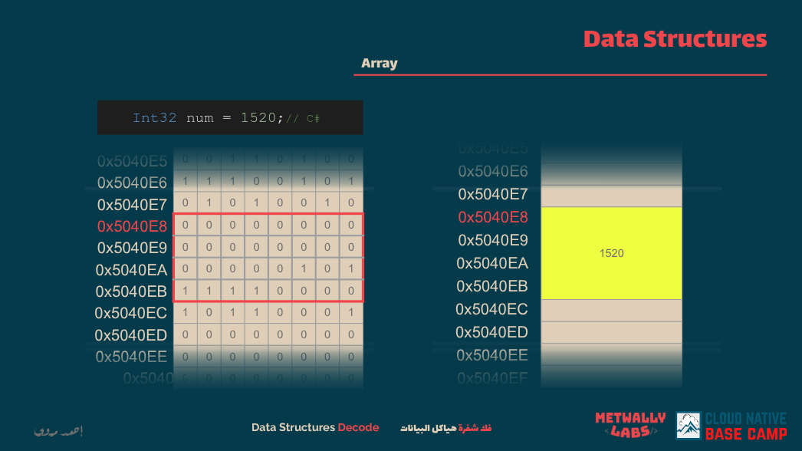
lecture link [Arrays-instroduction](https://cloudnativebasecamp.com/lessons/03-array-introduction/)

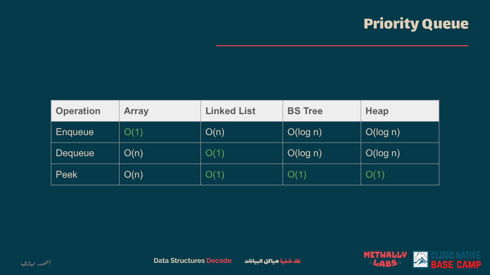
summary of data structures time complexity

## Data Structure

An array is a data structure that stores elements in a contiguous block of memory. Each element is accessed by its index, which starts from zero. Arrays provide fast access (`O(1)`) to elements using the index but have a fixed size, meaning you cannot change their length after creation (in lower-level languages). In TypeScript (and JavaScript), arrays are dynamic, meaning their size can grow or shrink.

Arrays are widely used because of their simplicity and speed in random access. However, operations like insertion and deletion (except at the end) can be costly (`O(n)`), as elements may need to be shifted.

Here is an example of array usage and manipulation in TypeScript:

```ts
// Declare an array of numbers
let numbers: number[] = [1, 2, 3, 4, 5];

// Access element by index
console.log(numbers[0]); // Output: 1

// Add an element at the end
numbers.push(6); // [1, 2, 3, 4, 5, 6]

// Remove the last element
numbers.pop(); // [1, 2, 3, 4, 5]

// Insert at the beginning
numbers.unshift(0); // [0, 1, 2, 3, 4, 5]

// Remove from the beginning
numbers.shift(); // [1, 2, 3, 4, 5]

// Find index of an element
let index = numbers.indexOf(3); // 2

// Remove element by index
if (index !== -1) {
  numbers.splice(index, 1); // [1, 2, 4, 5]
}

// Loop through the array
for (let num of numbers) {
  console.log(num);
}

// Map example
let squares = numbers.map((n) => n * n);
console.log(squares); // [1, 4, 16, 25]
```

Arrays are the foundation for many algorithms and problems in coding interviews. Understanding indexing, slicing, and iteration is critical.

## Problems

- **[easy]** [Two Sum](https://leetcode.com/problems/two-sum/)

Given an array of integers `nums` and an integer `target`, return indices of the two numbers such that they add up to `target`. You may assume that each input would have exactly one solution, and you may not use the same element twice.

---

- **[meduim]** [3Sum](https://leetcode.com/problems/3sum/)

Given an integer array `nums`, return all the triplets `[nums[i], nums[j], nums[k]]` such that `i != j`, `i != k`, and `j != k`, and `nums[i] + nums[j] + nums[k] == 0`. The solution set must not contain duplicate triplets.

---

- **[hard]** [First Missing Positive](https://leetcode.com/problems/first-missing-positive/)

Given an unsorted integer array `nums`, return the smallest missing positive integer. You must implement an algorithm that runs in `O(n)` time and uses constant extra space.

---

# Linked Lists

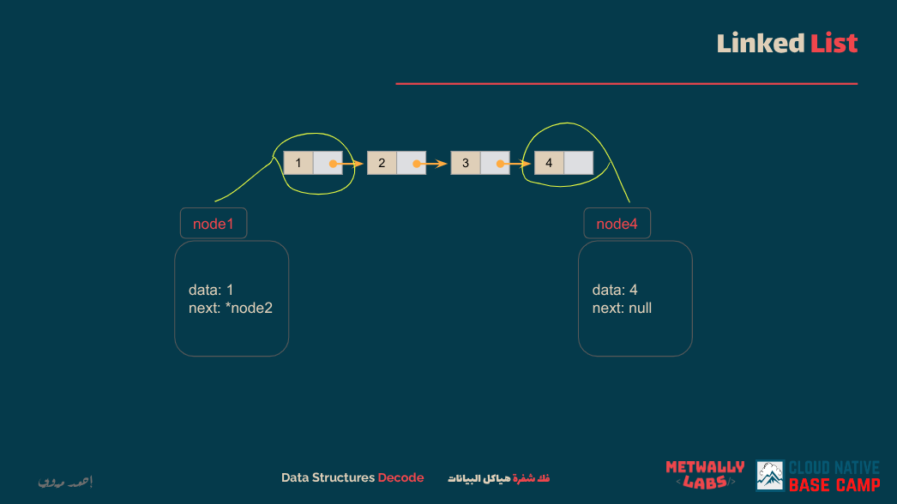
lecture link [Linked Lists](https://cloudnativebasecamp.com/lessons/05-linked-list-introduction-singly-list-implementation/)

## Data Structure

A linked list is a linear data structure where elements (called nodes) are stored in separate objects, and each node points to the next node in the sequence. Unlike arrays, linked lists do not store elements in contiguous memory locations. This makes insertion and deletion operations efficient (`O(1)` if you have the node reference) but makes accessing elements by index slower (`O(n)`).

In TypeScript, a singly linked list can be implemented using classes:

```ts
class ListNode {
  val: number;
  next: ListNode | null;

  constructor(val?: number, next?: ListNode | null) {
    this.val = val === undefined ? 0 : val;
    this.next = next === undefined ? null : next;
  }
}

// Create linked list: 1 -> 2 -> 3 -> null
let node3 = new ListNode(3);
let node2 = new ListNode(2, node3);
let head = new ListNode(1, node2);

// Traverse linked list
let current: ListNode | null = head;
while (current !== null) {
  console.log(current.val);
  current = current.next;
}

// Insert new node at the beginning: 0 -> 1 -> 2 -> 3 -> null
let newHead = new ListNode(0, head);

// Delete node (e.g., delete node 2)
current = newHead;
while (current.next !== null) {
  if (current.next.val === 2) {
    current.next = current.next.next; // Bypass node 2
    break;
  }
  current = current.next;
}
```

Linked lists come in several types: singly linked lists, doubly linked lists (where nodes point both forward and backward), and circular linked lists (where the tail node points back to the head).

## Problems

- **[easy]** [Reverse Linked List](https://leetcode.com/problems/reverse-linked-list/)

Given the head of a singly linked list, reverse the list, and return the reversed list.

---

- **[meduim]** [Add Two Numbers](https://leetcode.com/problems/add-two-numbers/)

You are given two non-empty linked lists representing two non-negative integers. The digits are stored in reverse order, and each node contains a single digit. Add the two numbers and return the sum as a linked list.

---

- **[hard]** [Merge k Sorted Lists](https://leetcode.com/problems/merge-k-sorted-lists/)

You are given an array of `k` linked-lists, each linked list is sorted in ascending order. Merge all the linked lists into one sorted linked list and return it.

---

# Array Based Stack

lecture link [Array Based Stack](https://cloudnativebasecamp.com/lessons/11-stack-array-based-implementation-2/)

## Data Structure

A stack is a linear data structure that follows the Last In First Out (LIFO) principle. The last element added to the stack is the first one to be removed. In TypeScript, stacks are often implemented using arrays because arrays provide efficient `push` and `pop` operations at the end (`O(1)` time complexity).

Stacks are commonly used in algorithms that involve recursion, parsing, backtracking, and checking balanced parentheses.

Here is how you can implement and use a stack using an array in TypeScript:

```ts
class Stack<T> {
  private items: T[] = [];

  // Push element onto the stack
  push(element: T): void {
    this.items.push(element);
  }

  // Pop element from the stack
  pop(): T | undefined {
    return this.items.pop();
  }

  // Peek at the top element
  peek(): T | undefined {
    return this.items[this.items.length - 1];
  }

  // Check if stack is empty
  isEmpty(): boolean {
    return this.items.length === 0;
  }

  // Get stack size
  size(): number {
    return this.items.length;
  }
}

// Example usage
let stack = new Stack<number>();
stack.push(1);
stack.push(2);
stack.push(3);

console.log(stack.pop()); // 3
console.log(stack.peek()); // 2
console.log(stack.isEmpty()); // false
console.log(stack.size()); // 2
```

This array-based stack is simple, efficient, and practical for most problems that require LIFO behavior.

## Problems

- **[easy]** [Valid Parentheses](https://leetcode.com/problems/valid-parentheses/)

Given a string `s` containing just the characters `'('`, `')'`, `'{'`, `'}'`, `'['`, and `']'`, determine if the input string is valid. An input string is valid if open brackets are closed by the same type of brackets and in the correct order.

---

- **[meduim]** [Daily Temperatures](https://leetcode.com/problems/daily-temperatures/)

Given an array of integers `temperatures` representing the daily temperatures, return an array `answer` such that `answer[i]` is the number of days you have to wait after the `i-th` day to get a warmer temperature. If there is no future day for which this is possible, put `0` instead.

---

- **[hard]** [Largest Rectangle in Histogram](https://leetcode.com/problems/largest-rectangle-in-histogram/)

Given an array of integers `heights` representing the histogram's bar height where the width of each bar is `1`, return the area of the largest rectangle in the histogram.

---

# Linked List Based Stack

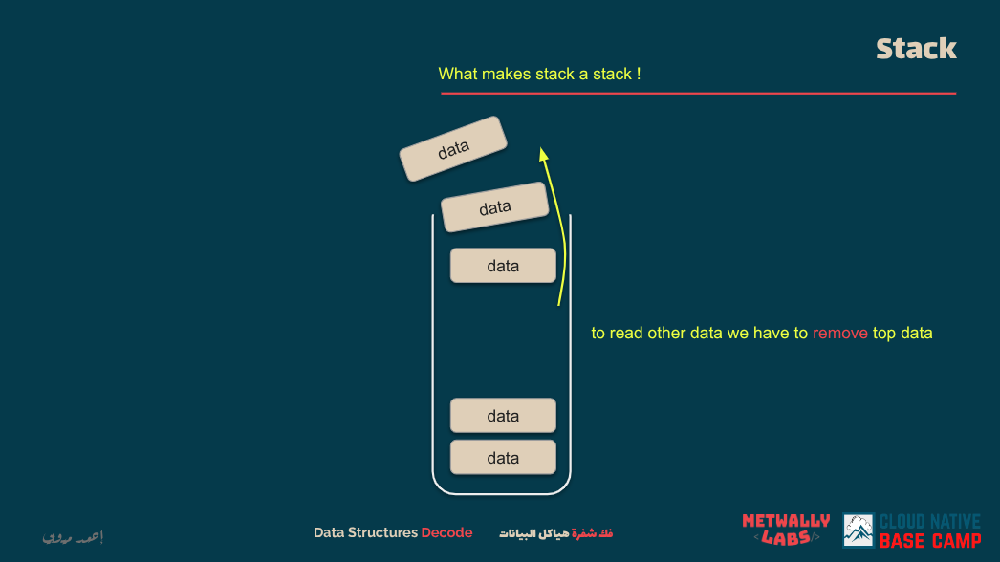
lecture link [Linked List Based Stack](https://cloudnativebasecamp.com/lessons/10-stack-linked-list-based-implementation/)

## Data Structure

A stack based on a linked list is a LIFO (Last In First Out) data structure where elements are stored in nodes, and each node points to the next one. Unlike array-based stacks, linked list stacks do not have a fixed size and can dynamically grow as needed without reallocating or shifting elements. The top of the stack is represented by the head of the linked list.

This makes `push` and `pop` operations efficient, both in `O(1)` time.

Here’s an example of implementing a stack using a singly linked list in TypeScript:

```ts
class ListNode<T> {
  val: T;
  next: ListNode<T> | null;

  constructor(val: T, next: ListNode<T> | null = null) {
    this.val = val;
    this.next = next;
  }
}

class LinkedListStack<T> {
  private head: ListNode<T> | null = null;
  private length: number = 0;

  // Push onto stack
  push(val: T): void {
    let newNode = new ListNode(val, this.head);
    this.head = newNode;
    this.length++;
  }

  // Pop from stack
  pop(): T | null {
    if (!this.head) return null;
    let val = this.head.val;
    this.head = this.head.next;
    this.length--;
    return val;
  }

  // Peek at the top element
  peek(): T | null {
    return this.head ? this.head.val : null;
  }

  // Check if stack is empty
  isEmpty(): boolean {
    return this.length === 0;
  }

  // Get stack size
  size(): number {
    return this.length;
  }
}

// Example usage
let stack = new LinkedListStack<number>();
stack.push(10);
stack.push(20);
stack.push(30);

console.log(stack.pop()); // 30
console.log(stack.peek()); // 20
console.log(stack.isEmpty()); // false
console.log(stack.size()); // 2
```

This structure avoids resizing issues found in arrays and is ideal when you need predictable `O(1)` insertion and removal without worrying about internal capacity.

## Problems

- **[easy]** [Implement Stack using Linked List](https://leetcode.com/problems/implement-stack-using-linked-list/)

Design a stack using a singly linked list where you must support standard stack operations like `push`, `pop`, `top`, and `empty`.

---

- **[meduim]** [Remove Nodes From Linked List](https://leetcode.com/problems/remove-nodes-from-linked-list/)

Given the head of a linked list, remove every node that has a node with a greater value to its right. Return the modified linked list's head.

---

- **[hard]** [Reverse Nodes in k-Group](https://leetcode.com/problems/reverse-nodes-in-k-group/)

Given a linked list, reverse the nodes of a linked list `k` at a time and return its modified list. `k` is a positive integer, and if the number of nodes is not a multiple of `k`, the remaining nodes should remain as is.

---

# Linked List Based Queue

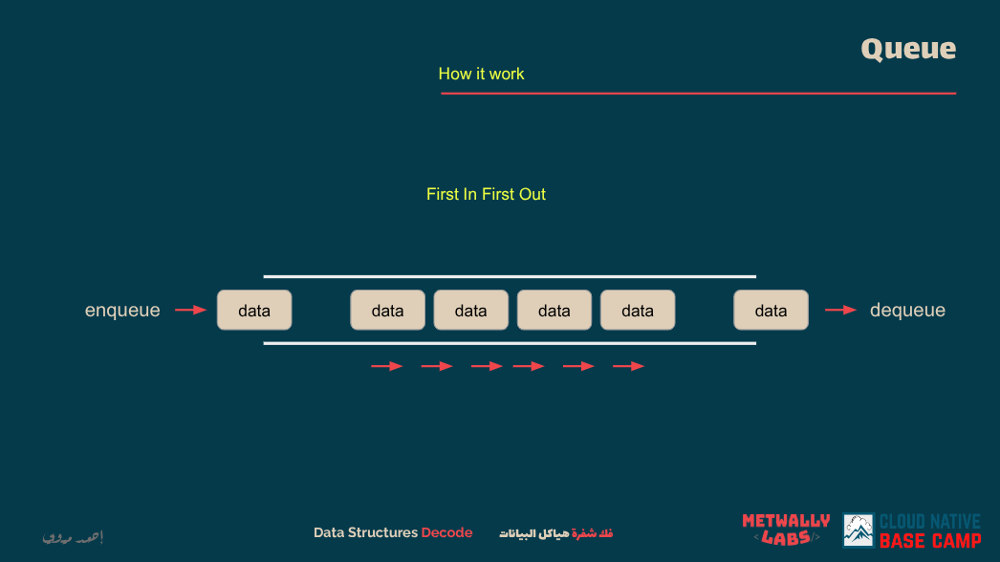
lecture link [Linked List Based Queue](https://cloudnativebasecamp.com/lessons/12-queue-linked-list-based-implementation/)

## Data Structure

A queue based on a linked list is a FIFO (First In First Out) structure where elements are stored in nodes connected through pointers. Unlike an array-based queue, the linked list version avoids the `O(n)` cost of shifting elements during dequeue, as both enqueue and dequeue operations happen in constant `O(1)` time by managing front and rear pointers.

Here’s an implementation in TypeScript using a singly linked list:

```ts
class ListNode<T> {
  val: T;
  next: ListNode<T> | null;

  constructor(val: T) {
    this.val = val;
    this.next = null;
  }
}

class LinkedListQueue<T> {
  private head: ListNode<T> | null = null;
  private tail: ListNode<T> | null = null;
  private length: number = 0;

  // Enqueue element at the end
  enqueue(val: T): void {
    const newNode = new ListNode(val);
    if (this.tail) {
      this.tail.next = newNode;
    }
    this.tail = newNode;
    if (!this.head) {
      this.head = newNode;
    }
    this.length++;
  }

  // Dequeue element from the front
  dequeue(): T | null {
    if (!this.head) return null;
    const val = this.head.val;
    this.head = this.head.next;
    if (!this.head) {
      this.tail = null;
    }
    this.length--;
    return val;
  }

  // Peek at the front element
  peek(): T | null {
    return this.head ? this.head.val : null;
  }

  // Check if queue is empty
  isEmpty(): boolean {
    return this.length === 0;
  }

  // Get queue size
  size(): number {
    return this.length;
  }
}

// Example usage
let queue = new LinkedListQueue<number>();
queue.enqueue(5);
queue.enqueue(10);
queue.enqueue(15);

console.log(queue.dequeue()); // 5
console.log(queue.peek()); // 10
console.log(queue.isEmpty()); // false
console.log(queue.size()); // 2
```

This structure is ideal when you require dynamic size and efficient enqueue/dequeue operations, particularly in scenarios like task scheduling or level-order traversal of trees.

## Problems

- **[easy]** [Design Circular Queue](https://leetcode.com/problems/design-circular-queue/)

Design your implementation of a circular queue. A circular queue is a linear data structure where the operations are performed based on FIFO and the last position is connected back to the first position to make a circle.

---

- **[meduim]** [Design Front Middle Back Queue](https://leetcode.com/problems/design-front-middle-back-queue/)

Design a queue that supports adding and removing elements from the front, middle, and back. All operations should be efficient, and you may use linked list concepts to manage dynamic insertions.

---

- **[hard]** [Maximum Performance of a Team](https://leetcode.com/problems/maximum-performance-of-a-team/)

You are given scores and speeds of engineers and must form a team with the maximum performance under certain constraints. The problem involves maintaining a dynamic group of selected engineers, which can be effectively modeled with a queue or heap structure.

---

# Array Based Queue

lecture link [Array Based Queue]() !it is not present

## Data Structure

A queue is a linear data structure that follows the First In First Out (FIFO) principle. The first element added to the queue will be the first one removed. In TypeScript, queues can be implemented using arrays by using the `push` method to enqueue and the `shift` method to dequeue. However, frequent use of `shift` can be inefficient (`O(n)`), so for better performance in production, you would use a circular buffer or a double-ended queue (deque).

Here is a simple and clear array-based queue implementation in TypeScript:

```ts
class Queue<T> {
  private items: T[] = [];

  // Enqueue element at the end
  enqueue(element: T): void {
    this.items.push(element);
  }

  // Dequeue element from the front
  dequeue(): T | undefined {
    return this.items.shift();
  }

  // Peek at the front element
  peek(): T | undefined {
    return this.items[0];
  }

  // Check if queue is empty
  isEmpty(): boolean {
    return this.items.length === 0;
  }

  // Get queue size
  size(): number {
    return this.items.length;
  }
}

// Example usage
let queue = new Queue<number>();
queue.enqueue(1);
queue.enqueue(2);
queue.enqueue(3);

console.log(queue.dequeue()); // 1
console.log(queue.peek()); // 2
console.log(queue.isEmpty()); // false
console.log(queue.size()); // 2
```

This structure is practical and works well for most algorithm problems, especially those involving level-order traversal or scheduling.

## Problems

- **[easy]** [Implement Queue using Stacks](https://leetcode.com/problems/implement-queue-using-stacks/)

Implement a first in first out (FIFO) queue using only two stacks. Your implemented queue should support all standard queue operations (`push`, `pop`, `peek`, and `empty`).

---

- **[meduim]** [Number of Recent Calls](https://leetcode.com/problems/number-of-recent-calls/)

You have a queue of incoming calls. Implement a system that counts the number of calls that happened in the past 3000 milliseconds, maintaining the FIFO nature of incoming events.

---

- **[hard]** [Sliding Window Maximum](https://leetcode.com/problems/sliding-window-maximum/)

Given an array `nums` and a sliding window size `k`, return the maximum value in each sliding window of size `k`. This requires an efficient solution that avoids recomputing maximums from scratch for each window.

---

# Key Value Pair Dictionary

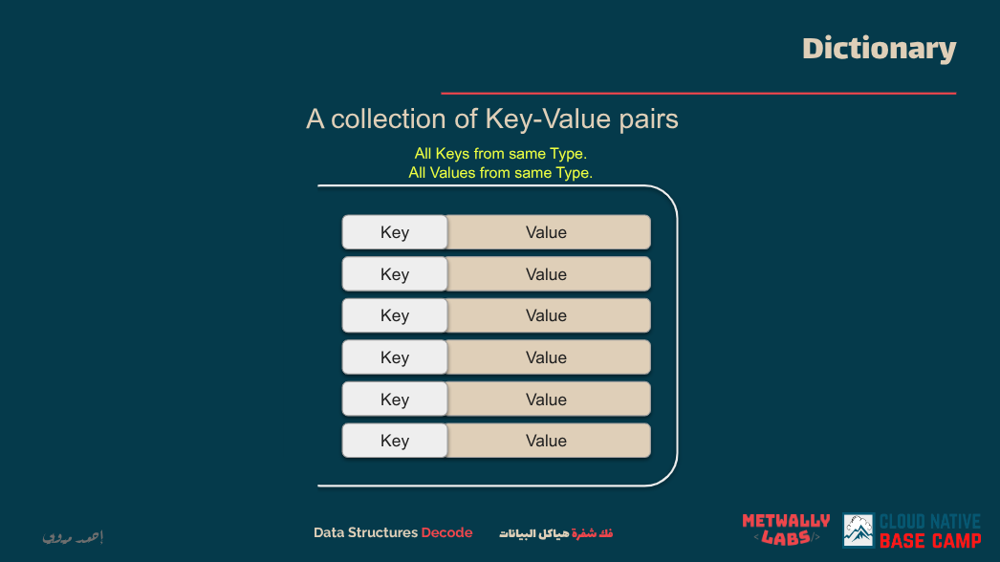
lecture link [Key Value Pair Dictionary](https://cloudnativebasecamp.com/lessons/13-keyvaluepair-dictionary-implementation/)

## Data Structure

A key-value pair dictionary, commonly called a hashmap or object in TypeScript, is a data structure that stores data in pairs where every key is unique and maps to a corresponding value. Lookup, insertion, and deletion operations generally run in `O(1)` time on average, which makes dictionaries extremely powerful for solving problems involving counting, lookup tables, or grouping.

TypeScript’s `Record`, `Map`, or plain objects can be used for this. Here is an example using a `Map` for type safety and consistency:

```ts
class Dictionary<K, V> {
  private items: Map<K, V>;

  constructor() {
    this.items = new Map<K, V>();
  }

  // Add or update key-value pair
  set(key: K, value: V): void {
    this.items.set(key, value);
  }

  // Get value by key
  get(key: K): V | undefined {
    return this.items.get(key);
  }

  // Check if key exists
  has(key: K): boolean {
    return this.items.has(key);
  }

  // Remove key-value pair
  delete(key: K): boolean {
    return this.items.delete(key);
  }

  // Get size
  size(): number {
    return this.items.size;
  }

  // Clear all entries
  clear(): void {
    this.items.clear();
  }
}

// Example usage
let dict = new Dictionary<string, number>();
dict.set("apple", 5);
dict.set("banana", 10);

console.log(dict.get("apple")); // 5
console.log(dict.has("banana")); // true
console.log(dict.size()); // 2
dict.delete("apple");
console.log(dict.get("apple")); // undefined
```

This structure is especially effective when you need fast lookups or need to count frequencies, check duplicates, or implement caching.

## Problems

- **[easy]** [Two Sum](https://leetcode.com/problems/two-sum/)

Given an array of integers `nums` and an integer `target`, return indices of the two numbers such that they add up to the target. You must solve it in `O(n)` using a dictionary for fast lookups.

---

- **[meduim]** [Subarray Sum Equals K](https://leetcode.com/problems/subarray-sum-equals-k/)

Given an array of integers `nums` and an integer `k`, return the total number of continuous subarrays whose sum equals to `k`. A hashmap is used to track cumulative sums efficiently.

---

- **[hard]** [Palindrome Pairs](https://leetcode.com/problems/palindrome-pairs/)

Given a list of unique words, find all pairs of distinct indices such that the concatenation of the two words forms a palindrome. A hashmap is used to check reversed strings in `O(1)` time.

---

# Hash Table

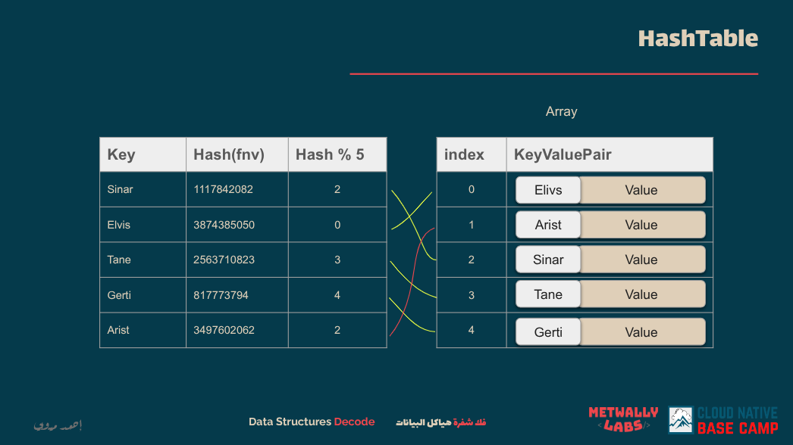
lecture link [Hash Table](https://cloudnativebasecamp.com/lessons/15-hash-table-introduction/)

## Data Structure

A hash table is a data structure that maps keys to values for efficient lookup. It uses a hash function to compute an index into an array of buckets or slots, from which the desired value can be found. Hash tables offer average-case constant time complexity `O(1)` for lookups, insertions, and deletions, making them ideal for scenarios requiring fast access to data.

In TypeScript, a hash table can be implemented using the built-in `Map` object, which preserves the insertion order of keys and allows any type of key.

```ts
class HashTable<K, V> {
  private table: Map<K, V>;

  constructor() {
    this.table = new Map<K, V>();
  }

  // Insert or update a key-value pair
  set(key: K, value: V): void {
    this.table.set(key, value);
  }

  // Retrieve a value by key
  get(key: K): V | undefined {
    return this.table.get(key);
  }

  // Check if a key exists
  has(key: K): boolean {
    return this.table.has(key);
  }

  // Remove a key-value pair
  delete(key: K): boolean {
    return this.table.delete(key);
  }

  // Get the number of key-value pairs
  size(): number {
    return this.table.size;
  }

  // Clear all key-value pairs
  clear(): void {
    this.table.clear();
  }
}

// Example usage
let ht = new HashTable<string, number>();
ht.set("apple", 5);
ht.set("banana", 10);

console.log(ht.get("apple")); // 5
console.log(ht.has("banana")); // true
console.log(ht.size()); // 2
ht.delete("apple");
console.log(ht.get("apple")); // undefined
```

This implementation provides an efficient way to store and retrieve key-value pairs, making it suitable for various applications such as caching, counting frequencies, and implementing associative arrays.

## Problems

- **[easy]** [Two Sum](https://leetcode.com/problems/two-sum/description/)

Given an array of integers `nums` and an integer `target`, return indices of the two numbers such that they add up to `target`. You may assume that each input would have exactly one solution, and you may not use the same element twice. You can return the answer in any order.

---

- **[meduim]** [Subarray Sum Equals K](https://leetcode.com/problems/subarray-sum-equals-k/)

Given an array of integers `nums` and an integer `k`, return the total number of continuous subarrays whose sum equals to `k`. A subarray is a contiguous non-empty sequence of elements within an array.

---

- **[hard]** [Palindrome Pairs](https://leetcode.com/problems/palindrome-pairs/description/)

You are given an array of unique words. A palindrome pair is a pair of integers `(i, j)` such that:

- `0 <= i, j < words.length`,
- `i != j`, and
- `words[i] + words[j]` (the concatenation of the two strings) is a palindrome.

Return an array of all the palindrome pairs of words. You must write an algorithm with `O(sum of words[i].length)` runtime complexity.

# Binary Search Tree

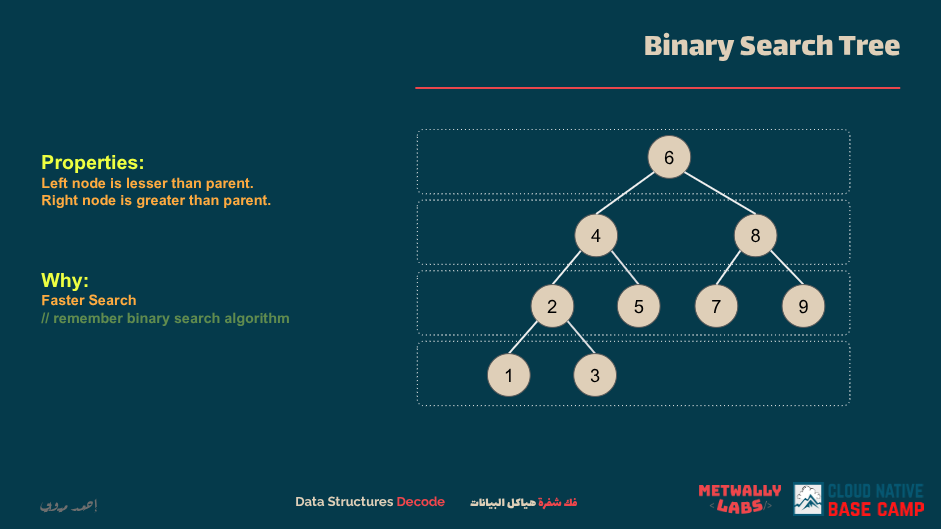
lecture link [Binary Search Tree](https://cloudnativebasecamp.com/lessons/19-binary-search-tree-introduction-inset-find/)

## Data Structure

A Binary Search Tree (BST) is a type of binary tree where each node has at most two children, referred to as the left and right child. The key property of a BST is that for every node:

- All elements in the left subtree are less than the node's value.
- All elements in the right subtree are greater than the node's value.

This property allows for efficient searching, insertion, and deletion operations, typically in O(log n) time, assuming the tree is balanced. However, in the case of an unbalanced BST, these operations can degrade to O(n) time.

Here's an implementation of a simple BST in TypeScript:

```ts
class TreeNode {
  value: number;
  left: TreeNode | null;
  right: TreeNode | null;

  constructor(value: number) {
    this.value = value;
    this.left = null;
    this.right = null;
  }
}

class BinarySearchTree {
  root: TreeNode | null;

  constructor() {
    this.root = null;
  }

  insert(value: number): void {
    const newNode = new TreeNode(value);
    if (this.root === null) {
      this.root = newNode;
      return;
    }
    let currentNode = this.root;
    while (true) {
      if (value < currentNode.value) {
        if (currentNode.left === null) {
          currentNode.left = newNode;
          return;
        }
        currentNode = currentNode.left;
      } else if (value > currentNode.value) {
        if (currentNode.right === null) {
          currentNode.right = newNode;
          return;
        }
        currentNode = currentNode.right;
      } else {
        return; // Duplicate values are not allowed
      }
    }
  }

  search(value: number): boolean {
    let currentNode = this.root;
    while (currentNode !== null) {
      if (value < currentNode.value) {
        currentNode = currentNode.left;
      } else if (value > currentNode.value) {
        currentNode = currentNode.right;
      } else {
        return true; // Value found
      }
    }
    return false; // Value not found
  }

  inorderTraversal(node: TreeNode | null = this.root): number[] {
    if (node === null) {
      return [];
    }
    return [
      ...this.inorderTraversal(node.left),
      node.value,
      ...this.inorderTraversal(node.right),
    ];
  }
}

// Example usage
const bst = new BinarySearchTree();
bst.insert(50);
bst.insert(30);
bst.insert(70);
bst.insert(20);
bst.insert(40);
bst.insert(60);
bst.insert(80);

console.log(bst.inorderTraversal()); // Output: [20, 30, 40, 50, 60, 70, 80]
console.log(bst.search(25)); // Output: false
console.log(bst.search(60)); // Output: true
```

This implementation provides basic methods for inserting values, searching for values, and performing an in-order traversal to retrieve values in sorted order.

## Problems

- **[easy]** [Find Mode in Binary Search Tree](https://leetcode.com/problems/find-mode-in-binary-search-tree/)

Given the root of a binary search tree (BST) with duplicates, return all the mode(s) (i.e., the most frequently occurred element) in it. If the tree has more than one mode, return them in any order.

---

- **[meduim]** [Validate Binary Search Tree](https://leetcode.com/problems/validate-binary-search-tree/)

Given the root of a binary tree, determine if it is a valid binary search tree (BST). A valid BST is defined as follows:

- The left subtree of a node contains only nodes with keys less than the node's key.
- The right subtree of a node contains only nodes with keys greater than the node's key.
- Both the left and right subtrees must also be binary search trees.

---

- **[hard]** [Lowest Common Ancestor of a Binary Search Tree](https://leetcode.com/problems/lowest-common-ancestor-of-a-binary-search-tree/)

Given a binary search tree (BST), find the lowest common ancestor (LCA) node of two given nodes in the BST. According to the definition of LCA on Wikipedia: “The lowest common ancestor is defined between two nodes p and q as the lowest node in T that has both p and q as descendants (where we allow a node to be a descendant of itself).”

# Binary Search Tree (Balanced)

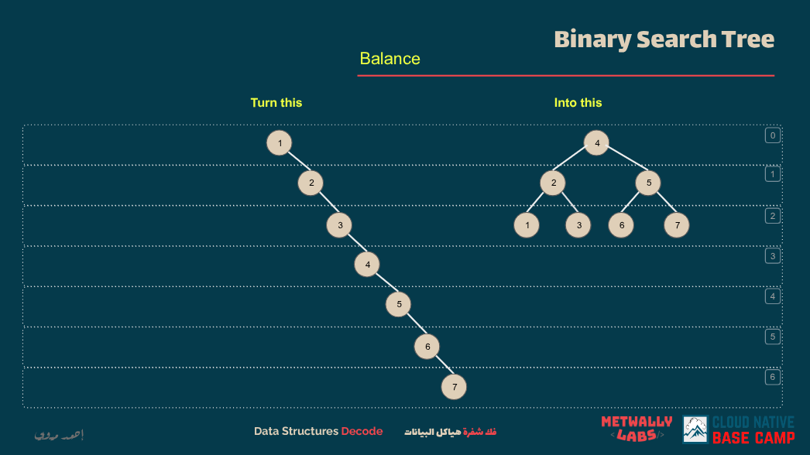
lecture link [Binary Search Tree (Balanced)](https://cloudnativebasecamp.com/lessons/21-binary-search-tree-balance/)

## Data Structure

A balanced binary search tree (BST) maintains the properties of a standard BST while ensuring that the tree remains balanced. This means that for every node, the height difference between its left and right subtrees is at most one. This balance ensures that operations like insertion, deletion, and search can be performed in O(log n) time, where n is the number of nodes in the tree.

One common type of balanced BST is the AVL tree, which automatically balances itself during insertions and deletions through rotations.

Here's an implementation of a balanced BST (AVL Tree) in TypeScript:

```ts
class TreeNode {
  value: number;
  left: TreeNode | null = null;
  right: TreeNode | null = null;
  height: number = 1;

  constructor(value: number) {
    this.value = value;
  }
}

class AVLTree {
  root: TreeNode | null = null;

  // Right rotate
  private rightRotate(y: TreeNode): TreeNode {
    let x = y.left!;
    let T2 = x.right;

    x.right = y;
    y.left = T2;

    y.height = Math.max(this.getHeight(y.left), this.getHeight(y.right)) + 1;
    x.height = Math.max(this.getHeight(x.left), this.getHeight(x.right)) + 1;

    return x;
  }

  // Left rotate
  private leftRotate(x: TreeNode): TreeNode {
    let y = x.right!;
    let T2 = y.left;

    y.left = x;
    x.right = T2;

    x.height = Math.max(this.getHeight(x.left), this.getHeight(x.right)) + 1;
    y.height = Math.max(this.getHeight(y.left), this.getHeight(y.right)) + 1;

    return y;
  }

  // Get height of node
  private getHeight(node: TreeNode | null): number {
    return node ? node.height : 0;
  }

  // Get balance factor of node
  private getBalance(node: TreeNode | null): number {
    return node ? this.getHeight(node.left) - this.getHeight(node.right) : 0;
  }

  // Insert a node
  insert(value: number): void {
    const insertNode = (node: TreeNode | null, value: number): TreeNode => {
      if (!node) return new TreeNode(value);

      if (value < node.value) {
        node.left = insertNode(node.left, value);
      } else if (value > node.value) {
        node.right = insertNode(node.right, value);
      } else {
        return node; // Duplicate values are not allowed
      }

      node.height =
        Math.max(this.getHeight(node.left), this.getHeight(node.right)) + 1;

      const balance = this.getBalance(node);

      if (balance > 1 && value < node.left!.value) {
        return this.rightRotate(node);
      }

      if (balance < -1 && value > node.right!.value) {
        return this.leftRotate(node);
      }

      if (balance > 1 && value > node.left!.value) {
        node.left = this.leftRotate(node.left!);
        return this.rightRotate(node);
      }

      if (balance < -1 && value < node.right!.value) {
        node.right = this.rightRotate(node.right!);
        return this.leftRotate(node);
      }

      return node;
    };

    this.root = insertNode(this.root, value);
  }

  // In-order traversal
  inorderTraversal(): number[] {
    const traverse = (node: TreeNode | null): number[] => {
      if (!node) return [];
      return [...traverse(node.left), node.value, ...traverse(node.right)];
    };
    return traverse(this.root);
  }
}

// Example usage
const avl = new AVLTree();
avl.insert(10);
avl.insert(20);
avl.insert(30);
avl.insert(25);
avl.insert(5);

console.log(avl.inorderTraversal()); // Output: [5, 10, 20, 25, 30]
```

This implementation ensures that the tree remains balanced after each insertion, providing efficient operations.

## Problems

- **[easy]** [Balanced Binary Tree](https://leetcode.com/problems/balanced-binary-tree/)

Given a binary tree, determine if it is height-balanced. A height-balanced binary tree is defined as a binary tree in which the depth of the two subtrees of every node never differs by more than one.

---

- **[meduim]** [Balance a Binary Search Tree](https://leetcode.com/problems/balance-a-binary-search-tree/)

Given the root of a binary search tree, return a balanced binary search tree with the same node values. If there is more than one answer, return any of them.

---

- **[hard]** [Convert Sorted List to Binary Search Tree](https://leetcode.com/problems/convert-sorted-list-to-binary-search-tree/)

Given the head of a singly linked list where elements are sorted in ascending order, convert it to a height-balanced binary search tree.

# Heap

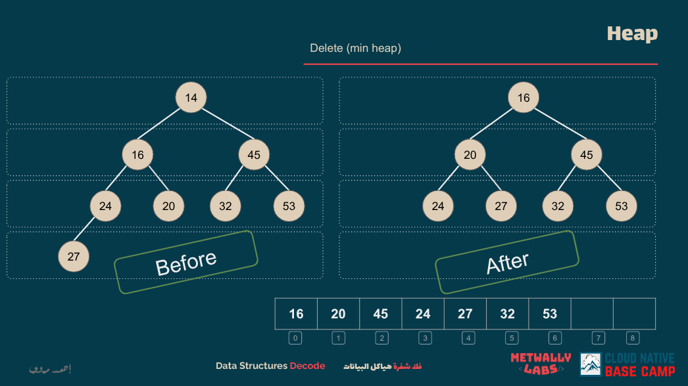
lecture link [Heap](https://cloudnativebasecamp.com/lessons/22-heap-implementation/)

## Data Structure

A heap is a specialized tree-based data structure that satisfies the heap property. It is a complete binary tree, meaning all levels are fully filled except possibly for the last level, which is filled from left to right. There are two main types of heaps:

- **Min-Heap**: The value of the root node is less than or equal to the values of its children, and the same property is recursively applied to all subtrees.
- **Max-Heap**: The value of the root node is greater than or equal to the values of its children, and the same property is recursively applied to all subtrees.

Heaps are commonly implemented using arrays, where for a node at index `i`:

- The left child is at index `2i + 1`
- The right child is at index `2i + 2`
- The parent is at index `(i - 1) / 2`

Here's an implementation of a Min-Heap in TypeScript:

```ts
class MinHeap {
  private data: number[];

  constructor() {
    this.data = [];
  }

  private getLeftChildIndex(parentIndex: number): number {
    return 2 * parentIndex + 1;
  }

  private getRightChildIndex(parentIndex: number): number {
    return 2 * parentIndex + 2;
  }

  private getParentIndex(childIndex: number): number {
    return Math.floor((childIndex - 1) / 2);
  }

  private hasLeftChild(index: number): boolean {
    return this.getLeftChildIndex(index) < this.data.length;
  }

  private hasRightChild(index: number): boolean {
    return this.getRightChildIndex(index) < this.data.length;
  }

  private hasParent(index: number): boolean {
    return this.getParentIndex(index) >= 0;
  }

  private leftChild(index: number): number {
    return this.data[this.getLeftChildIndex(index)];
  }

  private rightChild(index: number): number {
    return this.data[this.getRightChildIndex(index)];
  }

  private parent(index: number): number {
    return this.data[this.getParentIndex(index)];
  }

  private swap(indexOne: number, indexTwo: number): void {
    const temp = this.data[indexOne];
    this.data[indexOne] = this.data[indexTwo];
    this.data[indexTwo] = temp;
  }

  private heapifyUp(): void {
    let index = this.data.length - 1;
    while (this.hasParent(index) && this.parent(index) > this.data[index]) {
      this.swap(this.getParentIndex(index), index);
      index = this.getParentIndex(index);
    }
  }

  private heapifyDown(): void {
    let index = 0;
    while (this.hasLeftChild(index)) {
      let smallerChildIndex = this.getLeftChildIndex(index);
      if (
        this.hasRightChild(index) &&
        this.rightChild(index) < this.leftChild(index)
      ) {
        smallerChildIndex = this.getRightChildIndex(index);
      }

      if (this.data[index] < this.data[smallerChildIndex]) {
        break;
      } else {
        this.swap(index, smallerChildIndex);
      }
      index = smallerChildIndex;
    }
  }

  insert(value: number): void {
    this.data.push(value);
    this.heapifyUp();
  }

  remove(): number | null {
    if (this.data.length === 0) {
      return null;
    }
    const root = this.data[0];
    this.data[0] = this.data[this.data.length - 1];
    this.data.pop();
    this.heapifyDown();
    return root;
  }

  peek(): number | null {
    return this.data.length > 0 ? this.data[0] : null;
  }
}

// Example usage
const minHeap = new MinHeap();
minHeap.insert(10);
minHeap.insert(20);
minHeap.insert(5);
minHeap.insert(30);

console.log(minHeap.peek()); // Output: 5
console.log(minHeap.remove()); // Output: 5
console.log(minHeap.peek()); // Output: 10
```

This implementation provides methods to insert elements, remove the root element, and peek at the root element, all while maintaining the heap property.

## Problems

- **[easy]** [Last Stone Weight](https://leetcode.com/problems/last-stone-weight/)

We have a collection of stones, each with a positive integer weight. Each turn, we choose the two heaviest stones and smash them together. If the stones are of equal weight, both are destroyed; if the stones have different weights, the smaller stone is destroyed, and the larger stone's weight is reduced by the smaller stone's weight. Return the weight of the last remaining stone or 0 if there are no stones left.

---

- **[meduim]** [Kth Largest Element in an Array](https://leetcode.com/problems/kth-largest-element-in-an-array/)

Given an integer array `nums` and an integer `k`, return the kth largest element in the array. Note that it is the kth largest element in the sorted order, not the kth distinct element.

---

- **[hard]** [Find Median from Data Stream](https://leetcode.com/problems/find-median-from-data-stream/)

The problem is to design a data structure that supports the following two operations:

- `insertNum(int num)`: Inserts the integer `num` from the data stream.
- `findMedian()`: Returns the median of all elements inserted so far.

Implement the `MedianFinder` class:

```ts
class MedianFinder {
  constructor();
  insertNum(num: number): void;
  findMedian(): number;
}
```

# Priority Queue

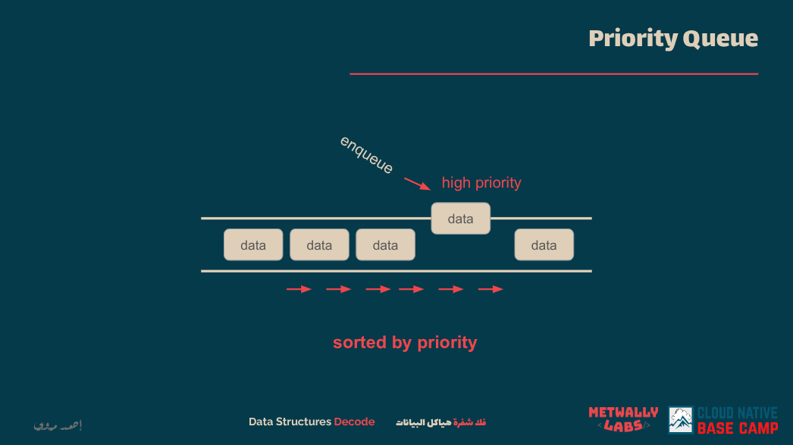
lecture link [Priority Queue](https://cloudnativebasecamp.com/lessons/23-priorityqueue/)

## Data Structure

A priority queue is an abstract data type that extends the functionality of a regular queue by associating a priority with each element. In a standard queue, elements are dequeued in the order they were enqueued (First In, First Out - FIFO). In contrast, a priority queue dequeues elements based on their priority, with the highest (or lowest) priority elements dequeued first, regardless of their order in the queue.

Priority queues are typically implemented using heaps, which are complete binary trees that maintain the heap property:

- **Max-Heap**: The value of each node is greater than or equal to the values of its children, ensuring that the maximum element is at the root.
- **Min-Heap**: The value of each node is less than or equal to the values of its children, ensuring that the minimum element is at the root.

These implementations allow for efficient insertion and removal operations, both of which can be performed in O(log n) time.

Here's an example of a priority queue implementation in TypeScript using a max-heap:

```ts
class MaxHeap {
  private heap: number[] = [];

  private parent(index: number): number {
    return Math.floor((index - 1) / 2);
  }

  private leftChild(index: number): number {
    return 2 * index + 1;
  }

  private rightChild(index: number): number {
    return 2 * index + 2;
  }

  private heapifyUp(index: number): void {
    while (index > 0 && this.heap[this.parent(index)] < this.heap[index]) {
      [this.heap[this.parent(index)], this.heap[index]] = [
        this.heap[index],
        this.heap[this.parent(index)],
      ];
      index = this.parent(index);
    }
  }

  private heapifyDown(index: number): void {
    let largest = index;
    const left = this.leftChild(index);
    const right = this.rightChild(index);

    if (left < this.heap.length && this.heap[left] > this.heap[largest]) {
      largest = left;
    }

    if (right < this.heap.length && this.heap[right] > this.heap[largest]) {
      largest = right;
    }

    if (largest !== index) {
      [this.heap[index], this.heap[largest]] = [
        this.heap[largest],
        this.heap[index],
      ];
      this.heapifyDown(largest);
    }
  }

  insert(value: number): void {
    this.heap.push(value);
    this.heapifyUp(this.heap.length - 1);
  }

  remove(): number | null {
    if (this.heap.length === 0) return null;
    const max = this.heap[0];
    this.heap[0] = this.heap.pop()!;
    this.heapifyDown(0);
    return max;
  }

  peek(): number | null {
    return this.heap.length > 0 ? this.heap[0] : null;
  }
}

// Example usage
const pq = new MaxHeap();
pq.insert(10);
pq.insert(20);
pq.insert(5);
console.log(pq.peek()); // Output: 20
console.log(pq.remove()); // Output: 20
console.log(pq.peek()); // Output: 10
```

In this implementation, the `insert` method adds a new element to the heap, and the `remove` method removes and returns the element with the highest priority (the root of the heap).

## Problems

- **[easy]** [Last Stone Weight](https://leetcode.com/problems/last-stone-weight/)

We have a collection of stones, each with a positive integer weight. Each turn, we choose the two heaviest stones and smash them together. If the stones are of equal weight, both are destroyed; if the stones have different weights, the smaller stone is destroyed, and the larger stone's weight is reduced by the smaller stone's weight. Return the weight of the last remaining stone or 0 if there are no stones left.

---

- **[meduim]** [Top K Frequent Elements](https://leetcode.com/problems/top-k-frequent-elements/)

Given a non-empty array of integers, return the k most frequent elements. Your answer should be sorted by frequency from highest to lowest. If two elements have the same frequency, sort them in descending order.

---

- **[hard]** [Find Median from Data Stream](https://leetcode.com/problems/find-median-from-data-stream/)

The problem is to design a data structure that supports the following two operations:

- `insertNum(int num)`: Inserts the integer `num` from the data stream.
- `findMedian()`: Returns the median of all elements inserted so far.

Implement the `MedianFinder` class:

```ts
class MedianFinder {
  constructor();
  insertNum(num: number): void;
  findMedian(): number;
}
```

# AVL Tree

avl tree is not mentioned in the course but wirth mentioning

## Data Structure

An AVL tree is a self-balancing binary search tree (BST) where the difference in heights between the left and right subtrees of any node is at most one. This balance factor ensures that the tree remains balanced, preventing it from degenerating into a linear structure, which could lead to inefficient operations.

### Properties

- **Balance Factor**: For any node, the balance factor is calculated as the height of the left subtree minus the height of the right subtree. The balance factor must be -1, 0, or 1 for all nodes.

- **Rotations**: To maintain balance after insertions or deletions, AVL trees perform rotations:

  - **Left Rotation (LL Rotation)**: Applied when the left subtree is taller.
  - **Right Rotation (RR Rotation)**: Applied when the right subtree is taller.
  - **Left-Right Rotation (LR Rotation)**: A combination of left and right rotations.
  - **Right-Left Rotation (RL Rotation)**: A combination of right and left rotations.

### TypeScript Implementation

```ts
class AVLNode {
  value: number;
  left: AVLNode | null = null;
  right: AVLNode | null = null;
  height: number = 1;

  constructor(value: number) {
    this.value = value;
  }
}

class AVLTree {
  root: AVLNode | null = null;

  private getHeight(node: AVLNode | null): number {
    return node ? node.height : 0;
  }

  private getBalanceFactor(node: AVLNode | null): number {
    return node ? this.getHeight(node.left) - this.getHeight(node.right) : 0;
  }

  private leftRotate(z: AVLNode): AVLNode {
    let y = z.right!;
    let T2 = y.left;

    y.left = z;
    z.right = T2;

    z.height = Math.max(this.getHeight(z.left), this.getHeight(z.right)) + 1;
    y.height = Math.max(this.getHeight(y.left), this.getHeight(y.right)) + 1;

    return y;
  }

  private rightRotate(y: AVLNode): AVLNode {
    let x = y.left!;
    let T2 = x.right;

    x.right = y;
    y.left = T2;

    y.height = Math.max(this.getHeight(y.left), this.getHeight(y.right)) + 1;
    x.height = Math.max(this.getHeight(x.left), this.getHeight(x.right)) + 1;

    return x;
  }

  private insertNode(node: AVLNode | null, value: number): AVLNode {
    if (!node) return new AVLNode(value);

    if (value < node.value) {
      node.left = this.insertNode(node.left, value);
    } else if (value > node.value) {
      node.right = this.insertNode(node.right, value);
    } else {
      return node; // Duplicate values are not allowed
    }

    node.height =
      1 + Math.max(this.getHeight(node.left), this.getHeight(node.right));

    let balance = this.getBalanceFactor(node);

    if (balance > 1 && value < node.left!.value) {
      return this.rightRotate(node);
    }

    if (balance < -1 && value > node.right!.value) {
      return this.leftRotate(node);
    }

    if (balance > 1 && value > node.left!.value) {
      node.left = this.leftRotate(node.left!);
      return this.rightRotate(node);
    }

    if (balance < -1 && value < node.right!.value) {
      node.right = this.rightRotate(node.right!);
      return this.leftRotate(node);
    }

    return node;
  }

  insert(value: number): void {
    this.root = this.insertNode(this.root, value);
  }

  inorderTraversal(node: AVLNode | null): void {
    if (node) {
      this.inorderTraversal(node.left);
      console.log(node.value);
      this.inorderTraversal(node.right);
    }
  }
}

// Example usage
const avlTree = new AVLTree();
avlTree.insert(10);
avlTree.insert(20);
avlTree.insert(30);
avlTree.insert(25);
avlTree.insert(5);

console.log("Inorder traversal of AVL tree:");
avlTree.inorderTraversal(avlTree.root);
```

This implementation provides methods for inserting nodes while maintaining the AVL tree properties and performing an inorder traversal to display the tree's contents.

## Problems

- **[easy]** [Convert Sorted List to Binary Search Tree](https://leetcode.com/problems/convert-sorted-list-to-binary-search-tree/)

Given the head of a singly linked list where elements are sorted in ascending order, convert it to a height-balanced binary search tree.

---

- **[meduim]** [Balance a Binary Search Tree](https://leetcode.com/problems/balance-a-binary-search-tree/)

Given the root of a binary search tree, return a balanced binary search tree with the same node values. If there is more than one answer, return any of them.

---

- **[hard]** [Count of Smaller Numbers After Self](https://leetcode.com/problems/count-of-smaller-numbers-after-self/)

Given an integer array nums, return an integer array counts where counts\[i] is the number of smaller elements to the right of nums\[i]. Implement this using a self-balancing binary search tree (AVL tree) for efficient querying.

# THE END

im glad to finish this thing and I hope I solve all the problems here

**If you reach this point; you are a hero**

for further updates this is my [linkedin](https://www.linkedin.com/in/kareem-anees-0496b62b3/)


